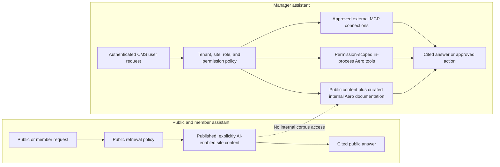
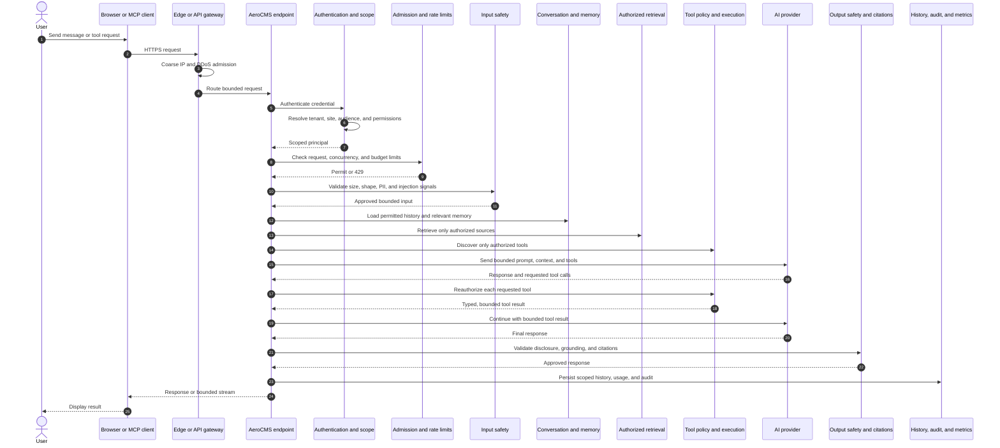

# AeroCMS AI and MCP Security Specification

**Status:** Living implementation specification

**Date:** 2026-07-26

**Scope:** Public AI search, member and manager assistants, conversation memory, knowledge ingestion, first-party tools, external MCP connections, and the AeroCMS MCP server.

## 1. Purpose

This specification defines the security boundaries for AI features in AeroCMS. It is intended to prevent tenant crossover, private-data disclosure, excessive tool authority, prompt-injection privilege escalation, and accidental persistence of sensitive information.

The primary design rule is:

> Retrieval, memory, and tool authorization are separate capabilities. Access to one must never imply access to the others.

The public assistant, authenticated member assistant, and manager assistant are different trust planes. They must not share an unrestricted retrieval pool, prompt, conversation history, memory store, or tool catalog.

## 2. Required security properties

Every AI request must satisfy all of the following:

1. The tenant and site are resolved by trusted server-side code.
2. The principal and audience are authenticated or explicitly anonymous.
3. Retrieval is filtered by tenant, site, culture, publication state, search inclusion, AI inclusion, and field sensitivity before ranking.
4. Conversation history and memory are scoped to the same tenant, site, audience, and principal.
5. Tool availability is computed server-side from the current principal and credential.
6. Every tool invocation is authorized independently at execution time.
7. Retrieved content and tool output are treated as untrusted data, not instructions.
8. Sensitive operations require explicit human approval.
9. Authorization failures, missing scope, ambiguous tenancy, and policy failures fail closed.

## 3. Trust planes



### 3.1 Public assistant

The public assistant may search only content that is:

- owned by the resolved tenant and site;
- published and publicly visible;
- valid for the requested culture or an approved culture fallback;
- included in site search;
- explicitly included in public AI answers;
- composed only from fields classified as publicly AI-exposable;
- accepted by PII and sensitivity policies.

The public assistant must not receive:

- drafts, scheduled content, deleted content, or manager-only content;
- internal AeroCMS documentation;
- other tenants' or sites' data;
- manager conversations or memories;
- arbitrary first-party mutation tools;
- arbitrary external MCP connections;
- secrets, API keys, system prompts, or internal diagnostic data.

Public answers are closed-book with respect to AeroCMS data: if eligible retrieval does not support an answer, the assistant must say that the information is unavailable. Claims based on retrieved content must include citations to the source records.

Eligible public source families are:

- pages;
- posts and blogs;
- docs;
- products and other explicitly public commerce catalog content;
- content types and content items explicitly enabled for public search and AI.

Enabling a source family does not bypass record- and field-level eligibility checks.

### 3.2 Authenticated member assistant

The initial member-assistant implementation uses the public knowledge corpus. Authentication adds durable, member-scoped conversation history, but does not automatically grant access to account, order, subscription, or other private business data.

Private member tools may be added later as separately authorized capabilities. Each such tool must enforce the current member, tenant, and site at execution time.

### 3.3 Manager assistant

The manager assistant may use:

- all public-assistant sources;
- curated internal AeroCMS documentation;
- site content allowed by the current CMS user's permissions;
- first-party AeroCMS tools;
- approved external MCP servers connected by an authorized manager.

Manager access is not equivalent to unrestricted database access. Retrieval and tools must honor selected-site membership, domain permissions, and operation permissions. An assistant must never infer authority from the user's prompt.

## 4. Content exposure model

The Manager should expose two distinct controls:

- **Include in site search**
- **Use in public AI answers**

Public AI eligibility requires both controls. Search inclusion alone must not publish content to the AI corpus.

### 4.1 Content-type defaults

Each content type should define:

- default search inclusion;
- default public-AI inclusion;
- default indexing strategy;
- field-level exposure classification;
- field-level sensitivity classification.

### 4.2 Field classifications

Recommended field classifications are:

- `Public`: eligible for public rendering and public AI retrieval.
- `Internal`: manager retrieval only.
- `Sensitive`: excluded unless a narrowly scoped internal workflow explicitly allows it.
- `Secret`: never indexed, embedded, placed in prompts, or returned by an AI tool.

Entry-level overrides may make a record more restrictive than its content type. They must not make a sensitive field public.

### 4.3 Indexing order

Security filtering occurs before full-text or vector ranking:

```text
tenant
  -> site
  -> culture
  -> audience
  -> publication state
  -> search inclusion
  -> AI inclusion
  -> field sensitivity
  -> full-text/vector ranking
```

Post-filtering a cross-tenant or mixed-visibility result set is not acceptable because unauthorized data may already have entered the model context.

## 5. Knowledge ingestion and documentation

### 5.1 Documentation sources

- `docs/` is the curated source for current public and internal product documentation.
- `.docs/` contains plans, design history, investigations, and tentative features. It is excluded from normal AI ingestion.
- Selected `.docs/` material may be published into a separate `DeveloperExperimental` corpus after explicit review.
- Generated `llms.txt` and `llms-aero-full.txt` artifacts are distribution formats, not the authoritative source.
- Original Markdown, Starlight, and DocFX content should be chunked by headings and semantic sections.

Git documentation remains authoritative. SurrealDB search records and embeddings are disposable projections that can be rebuilt.

The current manager-documentation implementation embeds the generated
`docs/manager-assistant-corpus.json` artifact into the AI module and reconciles
it at application startup into the dedicated
`ai_manager_documentation_chunks` projection. A separate
`ai_manager_documentation_corpus_states` record tracks the Git revision,
corpus checksum, search-schema version, chunk count, embedding model, dimensions, and whether the
entire current projection is vector-ready.

Public and member retrieval never query this projection. Manager retrieval
always has full-text access after successful reconciliation and uses vector
ranking only when the corpus state proves that every current chunk was
embedded with the active 384-dimension model. If no embedding provider is
registered, the projection remains full-text only. The Commerce documentation
is included through the same generated corpus and trust policy. The runtime
loader fails closed on unsupported schemas, trust classes, audiences,
canonical paths, or missing provenance. Startup reconciliation uses
optimistic concurrency and a bounded three-attempt retry for transient
database or embedding failures.

### 5.2 Chunk provenance

Every indexed chunk must carry:

- tenant and site identifiers, where applicable;
- source record type and identifier;
- source URI or route;
- culture;
- audience;
- publication and inclusion state;
- source revision and chunk revision;
- field classification;
- generated timestamp;
- checksum or content hash.

Changing publication, search inclusion, AI inclusion, culture, or sensitivity must invalidate affected chunks.

### 5.3 Search strategy

Use hybrid retrieval:

- full-text search for exact terms, names, identifiers, and quoted phrases;
- vector search for semantic matching;
- deterministic metadata filters for security boundaries;
- bounded reranking after authorization filters have been applied.

## 6. Conversation history and memory

Conversation history and long-term memory are different stores.

Recommended records are:

- `AiConversation`
- `AiMessage`
- `AiConversationSummary`
- `AiMemory`

All records use Snowflake `long` identifiers and include:

- tenant ID;
- site ID;
- audience (`Public`, `Member`, or `Manager`);
- principal type and principal ID;
- culture;
- creation and update timestamps;
- retention and deletion state.

### 6.1 History boundaries

- CMS-user conversations are private to that CMS user unless explicitly shared.
- Member conversations are private to that member.
- CMS-user and member histories never cross.
- Anonymous public conversations are ephemeral by default.
- A tenant administrator may govern retention, but does not automatically receive conversational content outside an audited support or compliance workflow.

The current implementation repeats tenant ID, site ID, audience, principal kind, principal ID, and culture on every conversation and message record. Every list, load, append, and delete operation reapplies that complete scope. A continuation request treats the browser's conversation ID only as a lookup key: provider history is reloaded from the server, and only the newest bounded user turn is accepted from the client.

Provider context is bounded to 20 messages and 32,000 characters. Durable transcripts are bounded to 200 messages per conversation and use a server-owned sequence number for deterministic ordering. Anonymous public conversations remain ephemeral. Authenticated member and manager conversations can be listed, resumed, and deleted through their respective scoped endpoints.

### 6.2 Long-term memory

Long-term memory is not an automatic transcript dump. A memory is written only when:

- the user explicitly asks the assistant to remember something; or
- the assistant proposes a memory and the user confirms it; or
- an administrator configures a narrowly defined, disclosed memory rule.

Memories must include provenance, scope, sensitivity, owner, and expiry. They are retrieved only when relevant to the current request and permitted in the current trust plane.

Users must be able to inspect, correct, export, and delete their conversation history and memories. Deleting a source record must invalidate summaries, embeddings, and derived memory that depend on it.

The manager implementation currently provides an explicit memory panel for add, inspect, correct, and delete operations. Saving requires a deliberate **Confirm memory** action; AeroCMS does not automatically extract memories from transcripts. Each user/site scope is bounded to 100 memories, each memory retains optional source conversation and message provenance, and those references are accepted only when they belong to the same complete security scope. Anonymous public and MCP callers cannot create personal memory. Memory export and configurable expiry remain future work.

## 7. Prompt injection, PII, and tool guardrails

### 7.1 Untrusted inputs

The following are untrusted:

- user prompts;
- content retrieved from pages, posts, docs, commerce, or content types;
- uploaded files;
- web results;
- MCP server descriptions;
- MCP tool output;
- output from SharpTS, Scriban, HTMX, or other user-authored scripts.

Instructions inside retrieved data do not authorize tools, change system policy, reveal secrets, or expand retrieval scope.

### 7.2 PII and sensitive-data controls

Apply defense in depth:

1. Classify fields and data sources at authoring time.
2. Scan ingestible content for likely PII, credentials, and secrets.
3. Exclude disallowed material before chunking and embedding.
4. Apply output DLP checks before returning public answers.
5. Redact sensitive values from telemetry, traces, and audit descriptions.
6. Store provider credentials and MCP secrets through AeroVault or an equivalent server-side encrypted secret reference.

The public assistant must never use another customer as an example derived from real tenant data.

### 7.3 Tool execution

Tools must be typed, allowlisted, and described by a domain plus operation. A tool result is data; it cannot request or approve another tool invocation.

Read-only public tools must remain read-only even if a prompt asks otherwise. Manager mutations, bulk exports, credential changes, publishing, deletion, and other material actions require human approval proportional to risk.

Ordinary logs must not contain raw API keys, provider credentials, complete prompts, complete retrieved documents, or unrestricted tool arguments and output. Security audit records should store identifiers, policy decisions, operation names, hashes, and redacted summaries.

## 8. Composable AI and MCP request pipeline

AI and MCP requests must use an explicit, ordered Chain of Responsibility. The pipeline is shared in shape, but each audience and operation receives only the stages and capabilities registered for it.

This is not one large ASP.NET Core middleware class. It is two cooperating layers:

1. **HTTP admission pipeline:** routing, authentication, endpoint rate limiting, authorization, request-size limits, and correlation.
2. **AI/MCP application pipeline:** audience and site scope, safety, conversation context, retrieval, tool authorization, provider execution, output checks, persistence, and audit.

ASP.NET Core middleware protects the HTTP boundary. Application stages protect work that is visible only after an assistant request or MCP tool call has been parsed.

### 8.1 End-to-end flow



Every denial stops the chain. A later stage cannot override an earlier authentication, authorization, rate-limit, or safety failure.

### 8.2 Application stages

The application pipeline should use ordered, independently testable stages over a typed request context and return `Result<T>`. Stages may enrich the context or stop processing, but must not mutate global authority.

| Order | Stage | Responsibility | Failure behavior |
| --- | --- | --- | --- |
| 1 | Request normalization | Correlation ID, supported operation, bounded input, cancellation, and request metadata | Reject invalid or oversized requests |
| 2 | Authentication and capability | Validate the session or key and establish the principal, API-key ID, and key-specific claims | Return `401` without disclosing credential details |
| 3 | Scope resolution | Establish audience, tenant, site, and culture from trusted server state and the authenticated capability | Fail closed when scope is missing, unauthorized, or ambiguous |
| 4 | Authorization | Check audience, site, domain, CRUD operation, publication state, and human-approval requirements | Return `403`; do not continue |
| 5 | Admission control | Check burst, sustained, concurrency, token/cost, and tool-operation budgets | Return `429` or a bounded quota response |
| 6 | Input safety | Apply schema validation, injection detection, PII policy, and content classification | Reject, redact, or route to approval |
| 7 | Context assembly | Load scoped conversation history and relevant explicit memories | Omit unavailable context; never broaden scope |
| 8 | Retrieval | Apply metadata authorization before hybrid search and bounded reranking | Return no results rather than cross a boundary |
| 9 | Tool catalog | Expose only typed tools allowed for the current principal and operation | Omit unauthorized tools |
| 10 | Provider execution | Reserve budget, invoke the selected provider, and enforce timeout and cancellation | Return a safe provider failure |
| 11 | Tool execution | Reauthorize every tool call, validate arguments, apply tool-specific limits, and audit | Deny independently of model output |
| 12 | Output policy | Check PII, secrets, citations, grounding, size, and audience suitability | Redact or reject unsafe output |
| 13 | Persistence and telemetry | Persist scoped history, reconcile usage, and write redacted audit/metrics | Do not expose internal persistence errors |

The same logical stages support public chat, member chat, manager chat, and MCP operations. Each feature composes a named profile rather than branching throughout a monolithic handler.

### 8.3 Rate-limiter ownership and module activation

Rate limiting is reusable infrastructure owned by `RateLimitingModule`. AI and MCP modules activate it by contributing named policies and attaching those policies to their own endpoints.

The ownership model is:

- **Host bootstrap:** calls `UseRateLimiter` exactly once in the ASP.NET Core pipeline.
- **RateLimitingModule:** owns shared abstractions, option validation, policy registration helpers, partition-key creation, `429` responses, `Retry-After`, metrics, and distributed-provider integration.
- **AiModule:** registers the public/member content-operation policies that it needs and applies them to AI endpoints.
- **AiAssistantModule:** registers manager assistant request, streaming concurrency, and provider-budget profiles.
- **AeroMcpModule:** registers MCP transport policies and applies them to `/mcp`; tool-level read/write limits run again after the MCP operation is parsed.
- **Feature tool modules:** may contribute tool-specific cost metadata, but do not implement independent counters.

`AiModule`, `AiAssistantModule`, and `AeroMcpModule` should declare `RateLimitingModule` as a dependency. If an AI or MCP module is enabled, its required rate-limiting policies are mandatory. An undefined policy or unavailable admission provider is a startup/configuration failure, not an instruction to run without limits.

The rate-limiting module must not depend on AI or MCP and must not know their endpoint implementations. Feature modules opt in using stable policy names:

```text
Aero.Ai.Public
Aero.Ai.Member
Aero.Ai.Manager
Aero.Ai.Stream
Aero.Mcp.Transport
Aero.Mcp.Read
Aero.Mcp.Write
Aero.Mcp.Destructive
```

Named HTTP policies are attached with ASP.NET Core endpoint metadata. Tool-level policies are invoked from the application pipeline because all MCP tools share the `/mcp` transport endpoint and the precise domain/operation is known only after protocol dispatch.

### 8.4 Limiter dimensions

A single request counter is insufficient. Policies may compose:

- a short burst limiter;
- a sustained request limiter;
- a concurrency limiter for active streams and provider calls;
- a token or cost budget;
- a tool-operation limiter for writes, deletes, exports, and bulk operations;
- a tenant plan or administrator-configured quota.

ASP.NET Core supports named endpoint policies, partitioned limiters, concurrency limiters, and chained limiters. AeroCMS should use stable, server-derived partition keys such as:

```text
tenantId|siteId|audience|principalType|principalId|policy
tenantId|siteId|apiKeyId|policy
tenantId|siteId|anonymousIp|policy
```

Never place the raw API key, prompt text, email address, or another secret/PII value in a partition key, metric label, or log. Unknown callers use a normalized client IP only after trusted-proxy and forwarded-header processing.

### 8.5 Admission layers

Rate limiting is applied at several layers:

1. **Edge/WAF:** coarse IP, connection, payload-size, and DDoS protection before AeroCMS.
2. **HTTP endpoint:** authenticated user/API-key or anonymous-IP request and concurrency limits.
3. **AI provider budget:** tenant/site/principal/model token and monetary budget.
4. **Tool invocation:** domain, operation, and risk-specific limits.

The HTTP pipeline target order for endpoint-specific, identity-aware policies is:

```text
Site resolution startup filter
  -> forwarded headers and trusted proxy handling
  -> routing
  -> request localization
  -> authentication
  -> rate limiting
  -> authorization
  -> AeroCMS module/application pipeline
```

ASP.NET Core requires endpoint-specific rate limiting after routing. AeroCMS additionally places authentication before the rate limiter so policies can partition on the validated API-key ID or authenticated principal rather than untrusted request data. Edge admission remains responsible for protecting authentication itself from volumetric abuse.

### 8.6 Distributed enforcement and failure behavior

ASP.NET Core's built-in limiter state is process-local unless AeroCMS supplies shared enforcement outside it. In a multi-instance deployment:

- the edge gateway may enforce coarse distributed request limits;
- Garnet or another atomic distributed counter provider may enforce tenant, key, and usage budgets;
- process-local ASP.NET Core concurrency and burst policies remain defense in depth;
- FusionCache must not be treated as an authoritative counter unless its configured provider supplies the required atomic acquire/release semantics;
- Sable is not the hot-path request counter.

Failure rules:

- security and spending limits fail closed when the authoritative distributed provider is unavailable;
- optional low-risk telemetry accounting may fail open only when explicitly classified and documented;
- rejected HTTP requests return `429 Too Many Requests`, a bounded `Retry-After` when known, a correlation ID, and no partition-key details;
- queued AI or MCP requests default to no queue or a very small bounded queue so disconnected clients do not consume hidden capacity;
- a streaming request holds its concurrency lease until the stream completes or is cancelled;
- provider retries consume or reserve budget because a retry may produce another billable provider request.

### 8.7 Current implementation baseline and remaining work

AeroCMS already:

- centralizes common ASP.NET Core limiter behavior and safe `429` responses in [`RateLimitingModule`](../src/Aero.Cms.Modules.RateLimiting/RateLimitingModule.cs);
- lets feature modules contribute configuration-backed fixed-window and concurrency policies;
- places `UseAuthentication` before `UseRateLimiter` and `UseAuthorization` in [`AeroCmsExtensions`](../src/Aero.Cms.Web.Bootstrap/AeroCmsExtensions.cs);
- attaches named policies to manager AI, SSE streams, MCP transport, MCP key management, and identity endpoints;
- exposes anonymous public and authenticated member assistant completion and SSE endpoints, plus a bounded public search endpoint;
- keeps anonymous public conversations ephemeral while persisting member and manager history under distinct principal kinds and complete tenant/site/audience/principal/culture scope;
- provides scoped conversation list, resume, and delete operations, and explicit manager memory add, correct, inspect, and delete operations;
- retrieves public/member answers only from published records explicitly enabled for search and public AI, returns a closed-book unavailable response when no eligible source supports the request, and never exposes manager tools to those audiences;
- performs security-filtered full-text/vector retrieval before bounded ranking and returns source citations with assistant responses;
- buffers provider stream output until the complete response passes server-side secret, high-risk identifier, size, and citation policy checks, so rejected content produces no unsafe SSE delta;
- requires public and member answers to cite only the server-supplied retrieval set using validated `[CMS-N]` identifiers;
- reserves a bounded provider-token allowance before each assistant provider call and reconciles the reservation against reported or conservatively estimated usage afterward;
- partitions token allowances by tenant, site, audience, principal, provider, and model, and returns `429 Too Many Requests` when the scoped allowance is exhausted;
- exposes token budgeting through `IAeroAiTokenBudgetCoordinator`, with a strict process-local default that can be replaced by an atomic distributed coordinator without changing assistant services;
- applies a second set of application-level MCP read, write, and destructive-operation limits after tool dispatch identifies the operation;
- partitions authenticated limits using server-derived tenant, site, principal, and API-key identifiers without storing raw keys in partition labels;
- exposes typed AI application-pipeline stages for normalization, audience and site scope, input safety, conversation context, retrieval, tools, execution, output policy, persistence, and telemetry.

Remaining work includes:

- adding monetary accounting and replacing the process-local token coordinator with atomic distributed enforcement for multi-instance quotas;
- completing rejection audit and operational dashboards;
- adding load, cancellation, and disconnected-stream lease tests;
- adding public/member front-end components over the implemented endpoints;
- adding an explicit operator-triggered documentation reindex endpoint in addition to startup reconciliation;
- adding export and expiry controls for conversations and explicit memories;
- connecting audit implementations to every declared pipeline stage.

The design aligns with the official ASP.NET Core guidance for [rate-limiting middleware](https://learn.microsoft.com/aspnet/core/performance/rate-limit?view=aspnetcore-10.0), including named endpoint policies, partitioning, concurrency limiting, chained limiters, `429` handling, and placement after routing.

## 9. AeroCMS MCP architecture

### 9.1 First-party manager tools

The built-in manager assistant should call first-party functionality in-process through `IAeroCmsToolExecutor` or the underlying application services. It should not call AeroCMS's own MCP endpoint through `localhost`.

The AeroCMS MCP server exists for external AI agents and interoperable MCP clients. Both paths should share the same application services and authorization requirements so that MCP cannot bypass business rules.

### 9.2 External MCP connections

External MCP connections are initially Manager-only. The Manager should provide **AI > Connections** with:

- tenant, site, and user ownership scope;
- server URL and transport;
- OAuth connection or encrypted credential reference;
- allowed tool list;
- read/write capability summary;
- approval mode;
- health, last-used, and revoke controls;
- audit history.

Outbound connections require URL validation, an outbound host allowlist, private-network restrictions, redirect validation, DNS-rebinding defenses, response-size limits, timeouts, and rate limits.

The public assistant must not receive arbitrary tenant-configured MCP tools.

## 10. AeroCMS MCP API-key authorization

### 10.1 Required claims

An API key used to connect to the AeroCMS MCP server must carry a key-specific MCP claim:

```text
aero.mcp_server=true
```

Possessing an AeroCMS API key or authenticating as a CMS user is not sufficient by itself. The MCP claim is an explicit capability grant.

The `/mcp` endpoint requires an AeroCMS API-key-authenticated principal. A short-lived bearer token minted from that API key is acceptable only when it preserves the key ID and all key-specific restrictions. An interactive manager cookie or a bearer token created only from a user's roles is not sufficient.

The key must also have:

- a tenant/site binding; and
- at least one effective read permission; or
- a key-specific admin privilege.

The canonical key permission claim is deliberately separate from the allowed-site claims:

```text
claim type:  aero.permission
claim value: <domain>:<operations>

claim type:  aero.site_id
claim value: <siteId>
```

Operations use:

```text
C = create
R = read
U = update
D = delete
```

Examples:

```text
aero.mcp_server = true
aero.site_id = 1529706005277655041
aero.permission = pages:R
aero.permission = docs:CRUD
aero.permission = content-items:RU
```

Multiple site and permission claims are allowed. The key is accepted for an MCP connection only when `aero.mcp_server=true` and the key has at least one `R` operation, unless its own `aero.api_key_admin=true` claim supplies all operations. The requested site is selected through `X-Aero-Site-Id` and must match one of the server-derived `aero.site_id` claims.

### 10.2 Permission domains

The initial domains are:

| Domain | Protected resources | Supported operations |
| --- | --- | --- |
| `pages` | Page records, revisions, hierarchy, and rendering metadata | `C`, `R`, `U`, `D` |
| `posts` | Post records, revisions, tags, and publication metadata | `C`, `R`, `U`, `D` |
| `docs` | Documentation records, revisions, hierarchy, and publication metadata | `C`, `R`, `U`, `D` |
| `content-types` | Content-type definitions, fields, indexes, and relationships | `C`, `R`, `U`, `D` |
| `content-items` | Content entries, hierarchy, relations, and publication state | `C`, `R`, `U`, `D` |
| `commerce` | Commerce resources exposed by the MCP server | `C`, `R`, `U`, `D` |

Commerce should be split as its MCP surface grows, for example:

```text
commerce.catalog
commerce.inventory
commerce.orders
commerce.customers
commerce.promotions
```

The broad `commerce` domain may be retained as a convenience grant for trusted integrations. Customer and order data must not be exposed through public AI retrieval merely because an MCP key can read commerce resources.

### 10.3 Tool authorization

The MCP connection check and the tool invocation check are separate:

1. Connection authorization requires `aero.mcp_server=true` and at least read authority.
2. Tool discovery returns only tools allowed by the key's effective permissions.
3. Tool execution rechecks the exact site, domain, and operation.
4. Application services enforce tenant, site, ownership, validation, and business rules.
5. The audit log records the key ID, principal, site, tool, domain, operation, result, and correlation ID.

Examples:

| Tool action | Required permission |
| --- | --- |
| List or get a page | `pages:R` |
| Create a page draft | `pages:C` |
| Update page content | `pages:U` |
| Delete a page | `pages:D` |
| Read a content-type schema | `content-types:R` |
| Create a content item | `content-items:C` |
| Reorder a content hierarchy | `content-items:U` |
| Read the product catalog | `commerce:R` or `commerce.catalog:R` |

Broad policies such as `site:read` and `site:create` are not sufficiently granular for MCP tool authorization. They may remain prerequisites during transition, but they must not be the final tool-level security contract.

### 10.4 Key-specific administrator privilege

An API key with:

```text
aero.mcp_server=true
aero.api_key_admin=true
```

has all registered CRUD permissions for pages, posts, docs, content types, content items, and commerce.

This admin privilege belongs to the API key. Creating a key for a CMS administrator must not automatically make the key an admin key. The privilege must be explicitly selected and audited when the key is created or rotated.

Admin does not bypass:

- the key's tenant and site boundary;
- expiration or revocation;
- rate limits;
- audit logging;
- tool input validation;
- server-side business invariants;
- human approval requirements for destructive or high-impact operations.

The effective privilege must be derived from the API key's claims, or from the intersection of key claims and the owning user's current site assignment. It must never silently expand to all privileges of the owning user's interactive session.

### 10.5 Credential and token propagation

Whether a client presents an API key directly or exchanges it for a short-lived bearer token, the resulting principal must preserve:

- key ID;
- key-specific MCP claim;
- key-specific permission claims;
- key-specific admin claim;
- tenant and allowed-site scope;
- expiry and revocation status.

Token exchange must not replace key claims with the owning user's complete role set. A scoped API key must remain scoped after exchange.

### 10.6 API-key lifecycle

The target key model supports multiple named keys per user or service account. Each key requires:

- Snowflake key ID;
- tenant ID and one or more allowed site IDs;
- owner or service-account ID;
- name and environment;
- one-way secret hash;
- MCP and permission claims;
- created, last-used, expiry, revoked, and rotated timestamps;
- creator and revoker IDs;
- optional rate-limit policy;
- audit history.

The raw key is returned only once. Rotation creates a replacement credential and supports an explicitly bounded overlap window. Revocation and permission changes must invalidate cached authorization and short-lived tokens.

### 10.7 Current implementation baseline and remaining work

AeroCMS now implements the key-scoped authorization boundary:

- [`ApiKeyDocument`](../src/Aero.Cms.Core.Entities/ApiKeyDocument.cs) persists a one-way secret hash, credential kind, tenant, allowed sites, MCP capability, key-specific administrator flag, canonical `domain:operations` permissions, expiry, revocation, rotation metadata, and audit fields.
- [`ApiKeyService`](../src/Aero.Cms.Modules.Security/ApiKeyService.cs) issues multiple named scoped keys, returns the raw secret once, validates active keys, normalizes permissions, lists safe metadata, and revokes keys inside their owner and tenant boundary.
- [`AeroApiKeyAuthenticationHandler`](../src/Aero.Cms.Modules.Security/AeroApiKeyAuthenticationHandler.cs) creates a principal solely from validated key state.
- [`AeroMcpModule`](../src/Aero.Cms.Modules.Mcp/AeroMcpModule.cs) requires the API-key MCP policy and an MCP transport limiter on `/mcp`.
- [`AeroCmsMcpInvocationContextFactory`](../src/Aero.Cms.Modules.Mcp/AeroCmsMcpInvocationContextFactory.cs) resolves the requested site only when it is present in the key's server-derived allowed-site claims.
- [`AeroCmsToolExecutor`](../src/Aero.Cms.Modules.Mcp/AeroCmsToolExecutor.cs) checks the exact domain and CRUD operation again at execution time and applies operation-class limits.
- [`JwtApi`](../src/Aero.Cms.Modules.Jwt/Areas/Api/v1/JwtApi.cs) preserves the key identity, tenant, sites, MCP capability, administrator flag, and permissions during short-lived token exchange; it does not add the owner's roles or issue a refresh token.
- [`AeroMcpApiKeyEndpoints`](../src/Aero.Cms.Modules.Mcp/AeroMcpApiKeyEndpoints.cs) provides administrator-only list, create, and revoke operations for tenant- and site-scoped MCP keys.
- in-process assistant tool discovery omits tools the current manager is not authorized to execute.

Remaining work includes:

- adding rotation and optional bounded-overlap management endpoints;
- invalidating authorization caches and exchanged tokens immediately after revocation or permission changes;
- adding dedicated service-account ownership where a key should not belong to a human user;
- adding key-management UI, per-key rate-limit profile selection, and richer audit history;
- adding commerce MCP tools and splitting the commerce permission surface as it grows;
- completing integration and adversarial tests against a live MCP transport.

## 11. Agentic patterns

The following patterns from the reviewed agentic-design guidance apply:

| Pattern | AeroCMS use |
| --- | --- |
| Routing | Select public, member, or manager policy before retrieval and tools |
| Prompt chaining | Separate intent, retrieval, answer generation, and output checks |
| Retrieval-augmented generation | Ground answers in authorized AeroCMS content |
| Memory management | Keep bounded history and explicit long-term memories |
| Guardrails | Apply tenant, sensitivity, PII, tool, and output policies |
| Human in the loop | Approve mutations and other high-impact operations |
| Tool/MCP use | Expose typed, permission-scoped application capabilities |
| Reflection | Check grounding and policy compliance, not grant authority |
| Exception recovery | Return bounded failures without leaking internal data |
| Evaluation | Continuously test retrieval, isolation, and authorization |
| Resource-aware optimization | Bound chunks, context, tool calls, and model cost |
| Learning and adaptation | Improve from reviewed evaluations, never from untrusted content automatically |

The source reviewed for these patterns is `D:\proj\agentic-design-patterns-docs\Agentic-Design-Patterns.pdf` and its supporting documentation.

## 12. Evaluation and security tests

Automated tests must cover:

- cross-tenant vector and full-text retrieval attempts;
- cross-site retrieval within the same tenant;
- culture fallback and culture isolation;
- unpublished, scheduled, deleted, search-disabled, and AI-disabled records;
- sensitive and secret field exclusion;
- public prompts asking for internal AeroCMS documentation;
- retrieved prompt injection requesting tool calls or secrets;
- MCP output containing malicious instructions;
- missing `mcp_server` claim;
- MCP claim with no read privilege;
- read-only keys attempting create, update, or delete;
- one-domain keys attempting another domain;
- one-site keys attempting another site;
- revoked and expired keys;
- scoped key exchange attempting to inherit owner roles;
- key-specific admin behavior and tenant/site boundaries;
- tool discovery omitting unauthorized tools;
- execution-time reauthorization after permission changes;
- PII and secret output detection;
- conversation and memory crossover between principals;
- burst and sustained limiter boundaries;
- independent partitions for tenants, sites, users, API keys, and anonymous clients;
- streaming concurrency leases released on completion, cancellation, and failure;
- `429` responses with safe `Retry-After` and correlation metadata;
- provider retries and tool loops correctly consuming reserved budgets;
- fail-closed behavior when an authoritative distributed limiter is unavailable;
- consistent enforcement across multiple application instances.

Every MCP tool requires unit tests for its permission mapping and integration tests for authorization, site isolation, validation, and audit behavior.

## 13. Recommended implementation sequence

1. Consolidate rate-limiter infrastructure, named policy registration, middleware ordering, and safe rejection handling.
2. Add the typed Chain-of-Responsibility contracts and the common scope, authorization, admission, safety, output, and audit stages.
3. Introduce the audience and content-exposure model.
4. Build security-filtered hybrid indexing with provenance and invalidation.
5. Persist scoped conversation history and explicit long-term memory. **Implemented baseline.**
6. Add public/member retrieval with citations and no arbitrary tools. **Implemented API baseline.**
7. Add curated internal documentation retrieval for the manager. **Implemented with startup reconciliation, full-text retrieval, optional all-or-nothing vector readiness, and Commerce corpus coverage.**
8. Upgrade API keys to key-scoped claims principals and multiple named keys. **Implemented baseline.**
9. Require `mcp_server=true` and `Aero.Mcp.Transport` on `/mcp`. **Implemented.**
10. Add domain-level CRUD requirements and tool-operation limits to discovery and execution. **Implemented baseline.**
11. Preserve key scope during API-key-to-token exchange. **Implemented.**
12. Add approved external MCP connections for managers.
13. Add commerce MCP tools and split commerce permissions where necessary.
14. Replace the process-local token coordinator with atomic distributed enforcement and add provider monetary accounting.
15. Add continuous security, rate-limit, quality, and tenant-isolation evaluations.

## 14. Accepted initial defaults

- Logged-in members use public knowledge only in the first release.
- Internal AeroCMS documentation is available only to the manager assistant.
- `.docs/` is excluded from ordinary RAG ingestion.
- External MCP connections are Manager-only.
- First-party manager tools execute in-process.
- Public tools are read-only and narrowly allowlisted.
- Long-term memory requires explicit or confirmed writes.
- Rate limiting is mandatory whenever an AI, assistant, or MCP module is enabled.
- The host installs rate-limiting middleware once; feature modules contribute and attach named policies.
- AI and MCP queues are disabled or kept very small and bounded.
- An AeroCMS MCP API key requires `mcp_server=true` and at least read authority.
- CRUD authority is granted per site and domain.
- API-key admin is explicit, key-specific, audited, and still site/tenant bounded.
