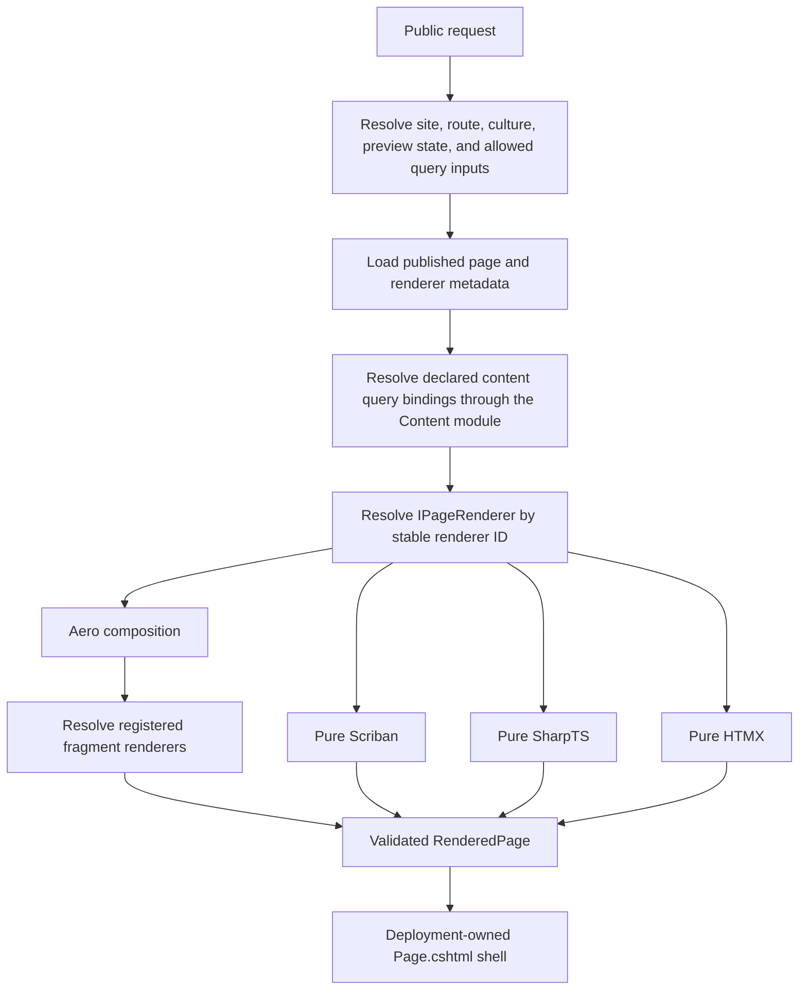

# Neo Rendering and Content Types Strategy

**Status:** In progress — Aero, Scriban, experimental interpreted SharpTS, HTMX, and content hierarchy slices implemented
**Date:** 2026-07-24  
**Scope:** Page rendering, page fragments, runtime templates, content hierarchies, and script-facing data contracts  
**Canonical path:** This document supersedes conflicting rendering decisions in older exploratory notes.

> The filename retains `staretgy` because it is the requested path. The document title uses the correct spelling.

## 1. Decision summary

AeroCMS should support four public page renderer types:

1. **Aero** — the visual composition editor. A page may contain ordinary elements, Scriban fragments, SharpTS fragments, and HTMX islands.
2. **Scriban** — a full page authored as a Scriban template.
3. **TypeScript (SharpTS)** — a full page authored in SharpTS. It can produce markup with Aero's `html` tagged-template API and can invoke approved RazorEngineCore templates by logical key.
4. **HTMX** — a full page authored as server-rendered HTML plus registered HTMX interactions.

The selected renderer belongs in page metadata. A registry-backed metadata dropdown is appropriate, but the persisted value should be a stable renderer ID rather than another member of `PageKind`.

```text
Page renderer
├── Aero composition
│   ├── ordinary visual elements
│   ├── Custom HTML fragment
│   ├── Scriban fragment
│   ├── SharpTS fragment
│   └── HTMX island/fragment
├── Pure Scriban page
├── Pure SharpTS page
└── Pure HTMX page
```

Content hierarchies are a separate concern from rendering. The Content module owns hierarchy rules and Sable queries. It returns immutable, bounded, pre-shaped trees to the selected renderer. Scriban and SharpTS may traverse `Children`; neither may query Sable or Orleans directly.

Runtime Razor is provided by RazorEngineCore, not RazorSlices, ASP.NET Core runtime compilation, or a new `.tshtml` language. RazorEngineCore templates contain Razor and C#. SharpTS calls an Aero-owned, allowlisted .NET facade; it never receives the compiler or unrestricted template-source API.

## 2. Current implementation baseline

This strategy distinguishes live behavior from proposed work.

| Capability | Current state | Strategy |
| --- | --- | --- |
| Aero visual composition | Implemented | Retain as `aero.composition` |
| Markdown fragment | Implemented | Retain through the fragment registry |
| Custom HTML fragment | Implemented in the existing element palette with the shared expandable Monaco editor | Keep one element and preserve strict HTML validation |
| Scriban fragment | Implemented; named eager hierarchy results are available under `content.<name>` | Retain the same closed script-data boundary |
| Scriban Monaco editor | Implemented through the shared expandable source-editor component | Reuse the component for later source-backed renderers |
| Page renderer registry and metadata | Implemented for `aero.composition`, `aero.scriban`, `aero.sharpts`, and `aero.htmx`; persisted stable IDs, API discovery, editor selection, publication validation, preview, and public dispatch are live | Keep renderer-specific behavior behind registered strategies |
| Pure Scriban public page | Implemented end to end with immutable Sable source versions, closed script scopes, secure execution, strict HTML import, publication snapshots, draft/public selection, and full-page Monaco authoring | Retain as the reference source-renderer implementation |
| SharpTS page or fragment | Experimental interpreted full-page and Aero-fragment renderers are implemented with a host `html` tag, detached context, denied imports, bounded output, and strict HTML import | Replace the in-process trusted-author runtime with a killable worker before untrusted authoring |
| HTMX page or fragment | Full-page and Aero-fragment renderers are implemented; a bounded same-origin HTMX attribute set plus the accepted `hx-on:*` exception passes through strict HTML import | Add the logical endpoint/action registry, antiforgery conventions, and capability gating |
| Content hierarchy fields, query, and manager UI | Persisted hierarchy rules and named queries, bounded Sable traversal, Scriban projection, expandable manager tree, breadcrumbs, search, drag/drop and explicit move controls, and cross-content-type parent selection are implemented | Add visual page-query authoring and query-input bindings |
| Runtime SharpTS-to-RazorEngineCore call | TUnit compatibility spike passes in interpreted and in-memory compiled SharpTS modes | Promote the concept behind an Aero-owned capability boundary |
| Framework-specific template CSS | Not implemented as a coherent feature | Keep separate from this delivery |

The existing `PageRenderedFragmentKind` enum and `IPageFragmentRenderer.Kind` dispatch remain a closed set. The persisted ordinals are explicit and SharpTS/HTMX were appended for this alpha slice; migration to stable fragment renderer IDs remains the extensibility direction.

The project is using Sable. Old Marten-named files and documentation are obsolete naming, not a persistence direction.

### 2.1 Implementation checkpoint — 2026-07-24

The first implementation slice intentionally registers only functionality that can
render safely today:

- `aero.composition` is resolved through `IPageRendererRegistry`; `Page.cshtml.cs`
  delegates to the selected renderer and remains the deployment-owned shell.
- Page documents, HTTP/Orleans contracts, validation, the manager metadata editor,
  and the renderer-discovery endpoint carry stable renderer IDs. Unknown IDs fail
  closed, and changing a persisted page's renderer requires a future explicit
  conversion workflow.
- The Content module persists explicit cardinality, structure, hierarchy rules,
  parent IDs, and sibling order. Draft/publish validation enforces singleton,
  placement, tenancy, cycle, depth, and publication invariants. The existing
  content-type and item editors preserve and edit the initial same-type hierarchy
  settings, parent, and sibling order.
- `IContentHierarchyQueryService` uses Sable and returns `Result<ContentQueryResult>`.
  Results are eager, immutable, culture/site/publication scoped, projected, and
  bounded by node count, depth, and approximate output size. Snowflake IDs cross
  this engine-neutral result boundary as canonical decimal strings.
- Page composition now persists bounded named `ContentQueryDefinition` entries
  using a stable content-type ID and diagnostic alias. Pages resolves them
  sequentially with authoritative site, culture, and preview state before
  renderer dispatch; invalid public declarations fail with 500 and unsaved
  fragment preview rejects them with 400.
- The hierarchy service now issues traversal-specific root/parent queries, so a
  requested branch is not lost when the same type contains more than 500 other
  items. Empty results still return the authoritative current content-type alias
  for output-cache dependency tagging.
- Content-type aliases are immutable until an explicit conversion workflow can
  update every dependent content item and route atomically. Hierarchy move
  validation includes the existing descendant subtree, so reparenting cannot
  push hidden descendants beyond the configured depth bound.
- Aero composition passes immutable results to fragments. Scriban receives only
  `content.<name>.roots`, `total_items`, and `was_truncated`, with eager recursive
  children and canonical string IDs; scripts receive no resolver or session.
- Custom HTML and Scriban fragments share one expandable Monaco source-editor
  component. The component owns Monaco state and accessible expand/restore
  behavior, while each dialog retains its engine-specific help, validation, and
  apply callback. Custom HTML still passes through the strict importer and
  Scriban still validates through the bounded server preview.
- New pages open a required renderer-selection modal before autosave can create
  a document. The modal is populated only from registered executable renderers,
  defaults to Aero, and starts the draft as `New Page`. A persisted page shows
  its renderer as immutable metadata.
- Hierarchical content types now use a manager tree rather than the flat data
  grid. The tree is site/culture scoped and bounded, supports search,
  expand/collapse, breadcrumbs, drag/drop placement, accessible move
  alternatives, root/child creation, and a selected-entry details panel.
  Moves normalize both affected sibling collections in one Sable commit.
- Content-type editing includes a searchable allowed-parent-type selector when
  same-type parents are not required. Entry editing uses the same server-shaped
  hierarchy for eligible parent choices and excludes the current subtree.
- Full-page source and Scriban-fragment surfaces expose an **Open AI assistant**
  entry point. It is enabled only when global AI and a usable content provider
  are enabled; otherwise it remains disabled with explanatory hover text. A
  source-aware review/apply contract remains a later enhancement, so the current
  control does not promise direct generation or overwrite Monaco content.
- The SharpTS/RazorEngineCore compatibility test uses the normal
  `dotnet:Aero.Cms.Rendering.Interop.Tests.RazorTemplateTestBridge` import in both
  interpreted and in-memory compiled modes. A test policy rejects non-allowlisted
  `dotnet:` imports and `@DotNetType`.
- Source-renderer behavior is descriptor-driven. Scriban, TypeScript, and HTMX
  use the same immutable draft/published source-version lifecycle, full-page
  Monaco workspace, preview endpoint, publication validation, and public
  renderer dispatch. The descriptor supplies Monaco language and initial source,
  preventing a newly selected source page from saving an empty draft.
- `aero.sharpts` is an explicitly experimental, trusted-author,
  in-process **InterpretOnly** renderer. Its first capability profile rejects
  imports, CommonJS imports, and `@DotNetType`; exposes detached page, site,
  content, and preview values with Snowflake IDs as strings; supplies the
  encoding `html` tag; bounds output; and validates returned markup. It does not
  yet provide compilation, binary caching, RazorEngineCore, or a hard CPU-kill
  boundary.
- `aero.htmx` validates source through the HTML importer. Request attributes
  require relative same-origin URLs; executable `hx-vals` and `hx-headers` forms
  are rejected; native `on*`, scripts, unsafe URLs, and unsupported elements
  remain denied. `hx-on:*` remains the documented alpha trusted-author exception.
- Aero composition now appends persisted fragment kinds `SharpTs = 3` and
  `Htmx = 4` after the original `Markdown = 0`, `CustomHtml = 1`, and
  `Scriban = 2`. The palette labels are **TS** and **HTMX**; both use expandable
  Monaco and authoritative server preview before apply.

Visual page-query authoring, SharpTS worker isolation, query-input bindings,
logical HTMX endpoint registration, RazorEngineCore promotion, and output
caching remain later slices below.

### 2.2 Production Scriban page checkpoint — 2026-07-24

The first complete source-renderer slice is now live:

- `PageSourceVersion` stores an exact, immutable inline source snapshot with
  site, page, renderer, SHA-256, and audit metadata. `PageDocument` holds
  independent draft and published source-version pointers.
- The Pages service stages a new source version and its page pointer in the same
  Sable session, then calls `SaveChangesAsync` once. Identical source reuses the
  existing version. Culture forks create a new version owned by the target page.
- Raw source is absent from `PageViewModel`, page lists, ordinary page details,
  page events, and MCP-facing metadata. It travels only through create/update
  authoring requests and the site-scoped manager source endpoint.
- `IPageRenderer` receives immutable page metadata, an optional preloaded source,
  selected HTML/composition snapshots, eager content-query results, and preview
  state. It receives no Sable session, Orleans actor, `HttpContext`, or mutable
  `PageDocument`.
- Pure Scriban exposes only `page`, `site`, `content`, and `is_preview`. Snowflake
  IDs are canonical decimal strings. Content-item globals such as `item`,
  `content_type`, and `fields` are intentionally absent.
- The secure Scriban runtime deep-clones the application-owned global scope while
  retaining strict variables, parsed-template caching, member restrictions,
  disabled template loading, execution/output limits, cancellation, and HTML
  sanitization.
- Save preview and publication both execute the selected renderer. Publication
  resolves content queries with drafts excluded and validates the exact draft
  source before copying the source pointer and content snapshots in one commit.
  A failed render leaves all published state unchanged.
- Translation-group publication uses the same site-scoped workflow as single-page
  publication. Every variant is validated before mutation, then all variants are
  snapshotted in one Sable commit; one failed render leaves the entire group
  unchanged.
- Public rendering selects only `PublishedSourceVersionId`; authorized draft
  preview selects only `DraftSourceVersionId`. Missing or cross-owned source
  fails closed. Direct `DraftId` selection at the public PageModel now requires
  the manager read policy before any page lookup.
- Unsaved preview is renderer-aware and server-controls site, culture, and
  preview state. A persisted page cannot be previewed through a different
  renderer without the explicit conversion workflow.
- `PageEditor` uses the renderer descriptor to retain the Aero visual canvas or
  show a primary full-page Monaco source workspace. The parent owns draft source;
  Monaco reports changes upward and is read authoritatively before preview/save.
  Source survives tab changes, expand/restore, creation, save, and reload.

Compile and focused TUnit coverage are green. The focused Playwright scenario is
present and discovered, but its shared fixture currently fails before the test
body because `Aero.Cms.Modules.EntraExternalId` is missing from the E2E output.

## 3. Goals

- Make page rendering open for extension without adding persisted enum members for every engine.
- Allow the page renderer to be selected when a page is created and displayed in page metadata.
- Give full-page source renderers and source-based fragments a good Monaco authoring experience.
- Support Scriban, SharpTS, HTMX, Custom HTML, and RazorEngineCore without letting those engines reach persistence directly.
- Make hierarchical content retrievable from custom pages through declarative, bounded query bindings.
- Detect culture and normalize the request context before resolving content or executing a renderer.
- Support query strings such as `/my-page?q=aero+cms` through explicit, allowlisted inputs.
- Compile templates/scripts once per source version, not once per request.
- Preserve the deployment-owned `Page.cshtml` shell and its security boundary.

## 4. Non-goals

- A `.tshtml` parser, Razor language service, or custom Razor code-generation backend.
- Using SharpTS as the language inside deployment-owned `.cshtml` files.
- User-authored Razor Pages, Razor Page code-behind classes, or runtime routing of arbitrary `.cshtml`.
- Allowing scripts to query Sable, obtain `IDocumentSession`, call arbitrary Orleans grains, or access `HttpContext`.
- Treating an `AssemblyLoadContext` as a security sandbox.
- Compiling Sass, Tailwind, Bulma, Bootstrap, or arbitrary CSS during page rendering.
- Selecting a different CSS framework per element.
- Adding RazorSlices to this dynamic feature. RazorSlices is source-generated/build-time technology and solves a different problem.

SharpTS integration with deployment-compiled Razor or `.cshtml` may be reconsidered after alpha or after 1.0. It belongs in the tentative feature list, not this initial implementation.

## 5. Architecture boundaries



The boundaries are intentional:

- **Page resolution** decides which published source version and renderer ID apply.
- **Content query resolution** produces script-safe immutable data before rendering.
- **Page renderers** turn a page source plus an immutable context into a `RenderedPage`.
- **Fragment renderers** turn registered composition sidecars into validated fragments.
- **The public shell** owns layout, common assets, CSP integration, and final response behavior.
- **HTMX endpoints** use the same content/query/renderer policies but return only a fragment response.

`Page.cshtml` should not contain a switch for Scriban, SharpTS, or HTMX. Its model should call the renderer registry and expose the already validated result to the shell.

## 6. Renderer IDs and the Open/Closed model

Do not add `SharpTs` or `Htmx` between implicit values in a persisted enum. More importantly, do not use a persisted enum as the renderer extension point.

Use stable IDs:

| Display name | Renderer ID |
| --- | --- |
| Aero | `aero.composition` |
| Scriban | `aero.scriban` |
| TypeScript (SharpTS) | `aero.sharpts` |
| HTMX | `aero.htmx` |

Conceptual contracts:

```csharp
public readonly record struct PageRendererId(string Value);

public sealed record PageRendererDescriptor(
    PageRendererId Id,
    string DisplayName,
    string EditorKind,
    bool SupportsFragments,
    bool IsExperimental);

public interface IPageRenderer
{
    PageRendererId Id { get; }

    Task<Result<RenderedPage>> RenderAsync(
        PageRenderRequest request,
        CancellationToken cancellationToken);
}

public interface IPageRendererRegistry
{
    IReadOnlyList<PageRendererDescriptor> GetDescriptors();
    Result<IPageRenderer> Resolve(PageRendererId id);
}
```

`PageKind` may continue to describe semantic page classification while it exists, but it should not also choose the execution engine. Renderer choice and semantic page kind are different axes.

This follows the intent behind an `IContentRenderer` strategy, but uses boundary-specific names. `IPageRenderer` renders a whole page, `IPageFragmentRenderer` renders a composition element, and the existing content-item renderer remains responsible for an individual content item. A single `IContentRenderer` name would blur those different inputs, policies, and output budgets.

The same approach applies to fragments:

| Fragment | Fragment renderer ID |
| --- | --- |
| Markdown | `core.markdown` |
| Custom HTML | `core.html` |
| Scriban | `core.scriban` |
| SharpTS | `core.sharpts` |
| HTMX | `core.htmx` |

```csharp
public readonly record struct PageFragmentRendererId(string Value);

public interface IPageFragmentRenderer
{
    PageFragmentRendererId Id { get; }

    Task<Result<RenderedFragment>> RenderAsync(
        PageFragmentRenderRequest request,
        CancellationToken cancellationToken);
}
```

Because AeroCMS is still pre-production, prefer the clean registry model and recreation of obsolete development data over compatibility mappings or upcasters. If the existing enum must survive an intermediate phase, assign explicit values to all existing members and append new temporary values only at the end.

## 7. Page metadata and editor selection

The page metadata stores:

- `RendererId`
- the renderer-specific draft source reference
- the renderer-specific published source version
- declared content query bindings
- optional linked style asset
- renderer settings that are safe to persist

The create-page flow presents a required renderer modal before opening the main editing surface:

- **Aero** opens the visual PageEditor.
- **Scriban** opens a full-page Scriban Monaco editor.
- **TypeScript (SharpTS)** opens a full-page TypeScript Monaco editor.
- **HTMX** opens a full-page HTML Monaco editor plus an interaction/endpoint panel.

The modal dropdown is populated from `IPageRendererRegistry.GetDescriptors()`.
Only registered executable renderers are shown, so the current UI offers Aero
and Scriban. SharpTS and HTMX appear automatically after their production
renderers are registered. This avoids hard-coded UI switches and permits a
module to contribute a renderer and its editor descriptor through explicit
registration or source generation.

Changing renderer type later can destroy renderer-specific source. The initial policy should be:

- allow a renderer change for an empty draft; and
- otherwise require an explicit conversion/reset command with a clear data-loss confirmation.

Publishing snapshots both the renderer ID and the referenced source versions. A published page must not silently begin using an edited draft template.

## 8. Aero composition elements

The Aero renderer retains the visual editor and ordinary elements. It gains two elements and one editor upgrade:

### 8.1 Custom HTML

“Custom HTML” already exists in the current element palette. Do not add a second “Raw HTML” element.

The recommended label is **Custom HTML** with helper text explaining that it accepts author-supplied HTML. “Raw” must not imply bypassing validation. Its output continues through the strict HTML importer and fails closed.

Upgrade its editor from a textarea to the shared Monaco source editor:

- language: `html`
- expandable/maximized editing
- live validation diagnostics
- preview using the same strict importer as publication
- exact source preservation on save

### 8.2 SharpTS element

The SharpTS element stores a source-version reference and declared content bindings. It returns one validated fragment. It uses the same SharpTS host as a full page but with smaller output, time, and data budgets.

The element palette label should be **TypeScript (SharpTS)**.

### 8.3 HTMX element

The HTMX element represents an island, not an arbitrary URL and script injection point. Its persisted sidecar should contain logical configuration such as:

- registered endpoint/action key
- HTTP verb
- trigger
- target
- swap behavior
- allowlisted parameters
- loading/fallback markup
- optional initial server-rendered fragment

The renderer materializes same-origin routes from registered endpoint keys. During the alpha, trusted authors may also persist `hx-on:*` JavaScript through the generic HTML policy. This is a deliberate, temporary executable-code capability rather than safe markup. Unrestricted endpoint URLs, arbitrary request headers, and native inline `on*` handlers remain unsupported. See [AeroCMS Scripting Security](../aero-scripting-security.md).

## 9. Expandable Monaco authoring

Extract the working Scriban Monaco integration into a reusable source-editor component or dialog used by:

- Custom HTML fragments
- Scriban fragments and full pages
- SharpTS fragments and full pages
- HTMX fragments and full pages
- approved RazorEngineCore template assets

Required behavior:

- language selection: `html`, `liquid`, `typescript`, or `razor`
- normal dialog/pane mode
- maximize/fullscreen toggle
- resizable layout where appropriate
- `automaticLayout`
- read the editor with `GetValue()` immediately before save
- set the complete source with `SetValue()` after loading or generating it
- validation/status panel
- preview action
- keyboard save command
- unsaved-change protection

For Aero fragments, Monaco may remain a dialog launched from the visual canvas, but that dialog must be expandable. For pure code pages, Monaco is the primary editing surface and replaces the visual canvas.

No npm dependency is required; use the existing BlazorMonaco integration and existing asset strategy.

## 10. Source and template storage

All executable or template source is versioned independently from the page record. A page points to a draft source version and a published source version.

Sources may be stored:

1. **Inline in Sable** — source text is stored in the version record.
2. **Managed asset storage** — Sable stores a provider ID and logical asset key. The provider resolves a managed file or object-store asset.

Never store or accept an arbitrary absolute filesystem path from an author.

Conceptual persistence shape:

```csharp
public sealed class TemplateAsset : Entity
{
    public long SiteId { get; set; }
    public string Name { get; set; } = "";
    public string EngineId { get; set; } = "";
    public long DraftVersionId { get; set; }
    public long? PublishedVersionId { get; set; }
}

public sealed class TemplateAssetVersion : Entity
{
    public long TemplateAssetId { get; set; }
    public string StorageProviderId { get; set; } = "sable.inline";
    public string? InlineSource { get; set; }
    public string? ManagedAssetKey { get; set; }
    public string ContentHash { get; set; } = "";
    public long Version { get; set; }
    public DateTimeOffset CreatedAt { get; set; }
}
```

Persisted infrastructure discriminators should use stable strings. If an enum is used for any closed storage state, assign explicit values from the beginning.

The storage service, not a renderer, decides how source is loaded:

```csharp
public interface ITemplateSourceStore
{
    Task<Result<TemplateSource>> GetPublishedAsync(
        long siteId,
        long templateAssetId,
        CancellationToken cancellationToken);
}
```

Source versions are immutable. Editing creates a new draft version. Publication atomically moves the published pointer after validation and compilation succeeds.

## 11. Pure Scriban pages

A pure Scriban page receives the same pre-shaped `PageRenderContext` and named content query results as all other renderers. It does not receive `HttpContext`, an Orleans client, or a Sable session.

The page source is parsed once per source hash and executed with:

- loop and recursion limits
- a cancellation/timeout budget
- member allowlists
- bounded output
- normalized culture
- script-safe ID projection

Scriban IDs should use the same canonical string representation as other script-facing contracts even though the current JSON-to-Scriban mapper can preserve a JSON integer as `long`. One stable public contract is preferable to engine-dependent identifier behavior.

## 12. Pure SharpTS pages and fragments

SharpTS is a .NET-hosted TypeScript implementation, but TypeScript `number` maps to a floating-point representation in the common case. Aero should not assume that every Snowflake `long` round-trips through every interpreted, compiled, JSON, and host-interoperability path.

Default script-facing rules:

- use `long` inside trusted C# domain and persistence code;
- expose Snowflake IDs to scripts as canonical decimal strings;
- introduce a `bigint` contract only after compatibility is proven in interpreted and compiled SharpTS modes; and
- never parse an unvalidated script-provided ID directly into a persistence query.

SharpTS execution policy should be configurable:

```text
Disabled
InterpretOnly
InterpretAndCompile
```

Interpretation and compilation are capabilities, not a per-page author choice. Compiled mode compiles on publish or cache miss, stores the binary artifact, and loads a worker-local entry point. It does not compile on every request.

CMS-authored SharpTS should run outside the trusted web process. `AssemblyLoadContext` can help unload code but is not a security boundary.

### 12.1 Aero `html` tagged templates

Aero supplies an `html` tag available to SharpTS:

```typescript
export async function render(context: PageRenderContext): Promise<HtmlFragment> {
    const tree = context.content.get("topics");

    return html`
        <main class="aero-page">
            <h1>${context.page.title}</h1>
            <ul>
                ${tree.roots.map(topic => html`
                    <li data-content-id="${topic.id}">
                        ${topic.fields.title}
                    </li>
                `)}
            </ul>
        </main>`;
}
```

The implementation must:

- escape scalar substitutions by default;
- flatten nested `HtmlFragment` instances without double encoding;
- support arrays/iterables of fragments;
- reject or encode arbitrary objects;
- enforce an output-size limit; and
- return a host-owned `HtmlFragment`, not an unrestricted string marked safe.

The final fragment still passes the renderer's HTML policy before reaching `Page.cshtml`.

### 12.2 RazorEngineCore from the same SharpTS source

A SharpTS source can use both the `html` tag and an approved RazorEngineCore template. The
production API is imported through SharpTS's normal `dotnet:` module syntax:

```typescript
import { AeroRenderFacade } from "dotnet:Aero.Cms.Rendering.AeroRenderFacade";

export async function render(context: PageRenderContext): Promise<HtmlFragment> {
    const model = {
        title: context.page.title,
        items: context.content.get("featured").roots
    };

    const cards = await AeroRenderFacade.renderRazor(
        context.executionToken,
        "shared.featured-cards",
        model);

    return html`
        <main class="aero-page">
            <header><h1>${context.page.title}</h1></header>
            ${cards}
        </main>`;
}
```

“Same `.ts` file” means the SharpTS program may compose both APIs in one render function. The Razor source may be:

- a separately versioned template asset referenced by logical key; or
- a sibling Razor asset in the same page/template package.

SharpTS receives only the logical key and a pre-shaped model. It does not receive:

- Razor source passed to a compile method
- compiler options
- assembly reference controls
- arbitrary type activation
- filesystem paths
- dependency-injection service resolution

The Aero host resolves the key, verifies site ownership and the published version, renders it, validates the markup, and returns an `HtmlFragment`.

### 12.3 SharpTS references and capability profiles

`dotnet:` imports are the default SharpTS-to-.NET interoperability mechanism in both interpreted
and compiled modes. Aero should use that supported surface rather than making
`@DotNetType` declarations the normal authoring model.

Each execution is assigned a host-owned capability profile such as
`rendering.safe-v1`. The host generates the `sharpts.json` manifest for that profile:

```json
{
  "references": ["./Aero.Cms.Rendering.Contracts.dll"],
  "packages": {}
}
```

The manifest is not author-controlled. CMS authors cannot:

- upload or edit `sharpts.json`;
- add NuGet packages;
- pass `-r` assembly references;
- select arbitrary assembly paths; or
- opt into a broader capability profile.

The initial safe profile references only the small Aero rendering-contract assembly. It does not
reference RazorEngineCore directly. The Aero facade checks the execution token, site, published
asset version, model shape, timeout, and output budget before invoking the isolated Razor worker.

A manifest is dependency resolution, not a security boundary. SharpTS can also resolve BCL types
and public types from assemblies already loaded by its process. Therefore Aero must parse the
SharpTS module graph and validate every static `dotnet:` import against the selected profile before
type checking, interpretation, or compilation. Unapproved imports fail publication and execution.
Dynamic `dotnet:` imports are rejected by SharpTS; Aero additionally rejects or explicitly validates
`@DotNetType` declarations so they cannot bypass the module-import policy.

Example policy:

```text
rendering.safe-v1
├── Aero.Cms.Rendering.AeroRenderFacade
├── Aero.Cms.Rendering.HtmlFragment
└── selected immutable context/value contracts

Denied by default
├── System.IO.*
├── System.Net.*
├── System.Reflection.*
├── System.Diagnostics.Process
├── Microsoft.Extensions.DependencyInjection.*
└── persistence, Orleans, and HTTP host types
```

The allowlist is defense in depth and API minimization. CMS-authored SharpTS still runs outside the
web process under a restricted OS identity because any in-process .NET execution profile is trusted
code from the CLR's point of view.

## 13. RazorEngineCore runtime templates

RazorEngineCore is appropriate here because its host API is ordinary .NET and it can compile Razor/C# source at runtime. A SharpTS program can invoke an Aero-owned .NET facade in both interpreted and compiled execution modes.

The completed compatibility spike proves:

- an interpreted SharpTS program can invoke the allowlisted .NET bridge;
- an in-memory compiled SharpTS program can invoke the same bridge; and
- the bridge can render a RazorEngineCore template.

The spike is evidence of interoperability, not the production hosting API. The tested SharpTS
package is distributed as a .NET tool rather than a conventional library package, but MSBuild can
consume its assemblies through an explicit `PackageDownload` plus `Reference`. That is acceptable
inside the dedicated execution-worker project when the SharpTS version, assembly paths, copied
runtime dependencies, and upgrade tests are owned deliberately. It should not leak into the web
application as an incidental direct reference. An upstream library package can replace this
packaging adapter later without changing the renderer or capability contracts.

### 13.1 Trust boundary

RazorEngineCore templates contain C# and are arbitrary trusted .NET code. An allowlisted facade prevents SharpTS from dynamically selecting compiler inputs, but it does not make untrusted Razor source safe.

Therefore:

- RazorEngineCore is disabled by default.
- Only principals with an explicit trusted-template permission may author or publish Razor template source.
- Runtime compilation occurs in an isolated worker/process profile with restricted OS identity, filesystem, environment, and network access.
- The web process never treats `AssemblyLoadContext` as a sandbox.
- A Razor template cannot receive `HttpContext`, `IServiceProvider`, persistence sessions, or arbitrary host objects.
- The model is a pre-shaped data contract.

Recommended setting:

```text
RazorTemplateExecution
├── Disabled
└── TrustedRuntimeCompile
```

### 13.2 Compilation and caching

RazorEngineCore can write compiled templates to a stream and load them later. Aero should use:

- **L1:** loaded template instance, factory, or delegate; worker-local only
- **L2/artifact storage:** compiled assembly bytes keyed by engine version, references fingerprint, source hash, and options hash
- **Sable:** source/version metadata and publication pointers; source of truth

RazorEngineCore does not provide the CMS cache policy. Aero owns cache keys, invalidation, validation state, and artifact lifecycle.

### 13.3 Explicitly rejected alternatives

- **RazorSlices:** build-time/source-generated, so it does not meet runtime authoring requirements.
- **`AddRazorRuntimeCompilation`:** obsolete in ASP.NET Core .NET 10 and coupled to the MVC Razor pipeline.
- **`.tshtml`:** requires a new parser/tooling/code-generation surface far beyond this feature.
- **Runtime user-authored Razor Pages:** changes routing and application code and is outside this feature.

## 14. Pure HTMX pages and HTMX islands

HTMX is an HTML interaction model, not a second client application framework. A pure HTMX page still produces an initial server-rendered document inside the normal `Page.cshtml` shell.

A full HTMX page consists of:

- versioned HTML template source;
- declared content query bindings;
- a manifest of registered actions/endpoints;
- validated HTMX attributes; and
- optional linked CSS.

HTMX fragments use Minimal API endpoints or Razor handlers registered by modules. An endpoint returns only the validated fragment needed for the swap.

### 14.1 Attribute policy

The current generic HTML policy temporarily allows only the `hx-on:*` namespace as a trusted-author alpha feature. Other `hx-*` attributes remain denied unless a catalog element or a future dedicated HTMX policy explicitly allows them. Native inline `on*` handlers remain denied. The exception and its removal criteria are recorded in [AeroCMS Scripting Security](../aero-scripting-security.md).

Create a dedicated HTMX policy that allowlists required attributes, for example:

- `hx-get`
- `hx-post`
- `hx-trigger`
- `hx-target`
- `hx-swap`
- `hx-include`
- `hx-indicator`
- `hx-push-url` where explicitly allowed

Persist logical action keys and materialize routes server-side. Reject:

- external or protocol-relative URLs
- `javascript:` and other executable schemes
- arbitrary request headers
- inline event handlers
- arbitrary extensions

The target hardened policy removes `hx-on:*` from ordinary author permissions. Executable authoring uses the site-scoped `site:script` policy described in [AeroCMS Scripting Security](../aero-scripting-security.md). A script mutation requires both the ordinary content mutation policy and `site:script`; the scripting permission does not grant general content write access.

Mutation endpoints require authorization and antiforgery protection. GET fragment responses may be cached only from declared dependencies and allowed query inputs. Mutations should normally be `no-store`.

## 15. Content hierarchy model

Content type hierarchy means content items form a tree. It is not CLR inheritance and is not inheritance between content type definitions.

Add independent cardinality and structure dimensions:

```csharp
public enum ContentCardinality
{
    Singleton = 0,
    Collection = 1
}

public enum ContentStructure
{
    Flat = 0,
    Hierarchical = 1
}
```

Add item placement:

```csharp
public sealed class ContentItem : Entity
{
    // Existing fields omitted.
    public long? ParentId { get; set; }
    public int SortOrder { get; set; }
}
```

`ParentId` is the source of truth. A materialized path, depth, or ancestor index may be added later as a derived optimization. Do not create two independently mutable hierarchy representations.

Hierarchy rules belong to the content type definition:

```csharp
public sealed record ContentHierarchyRules(
    bool AllowRootItems,
    bool RequireSameTypeParent,
    int MaximumDepth,
    IReadOnlySet<long> AllowedParentContentTypeIds,
    string DefaultOrdering);
```

Validation must reject:

- self-parenting;
- cycles;
- parents from another site;
- disallowed parent types;
- depth beyond the configured or system maximum;
- moving a parent beneath one of its descendants; and
- placement that violates publication or tenancy rules.

Sibling ordering should use an explicit stable value. Reordering is a Content module command, not arbitrary mutation from a script.

## 16. Declarative hierarchy queries

Custom pages retrieve content through named query bindings saved with the page/template. The query service compiles those definitions to Sable operations internally.

Supported query shapes should include:

- roots
- direct children
- descendants with maximum depth
- ancestors
- references
- filters
- stable sorting
- paging
- field projection
- preview versus published state

Conceptual contracts:

```csharp
public sealed record ContentQueryDefinition
{
    public string Name { get; init; }
    public long ContentTypeId { get; init; }
    public string ContentTypeAlias { get; init; } // diagnostics only
    public ContentTraversal Traversal { get; init; }
    public long? RootId { get; init; }
    public int MaximumDepth { get; init; }
    public int MaximumItems { get; init; }
    public ImmutableArray<string> Projection { get; init; }
}

public interface IContentHierarchyQueryService
{
    Task<Result<ContentQueryResult>> QueryAsync(
        ContentQueryRequest request,
        CancellationToken cancellationToken);
}
```

Use the preferred `Result<T>` form. In Aero.Core, `Result<T>` derives from `Result<T, AeroError>`, so the shorter signature preserves the same error type while matching project conventions.

The service uses Sable's `IDocumentSession`. No public contract should mention Marten.

### 16.1 Immutable script-facing result

```csharp
public sealed record ContentQueryResult(
    string Name,
    string ContentTypeAlias,
    ImmutableArray<ContentNode> Roots,
    int TotalItems,
    bool WasTruncated);

public sealed record ContentNode(
    string Id,
    string ContentType,
    ImmutableDictionary<string, object?> Fields,
    ImmutableArray<ContentNode> Children);
```

The real contract may use a stronger `ContentValue` discriminated model instead of `object?`, but it must remain immutable and serializable.

Every query is bounded by:

- site and tenant
- detected culture
- publication/preview state
- allowed content types
- maximum items
- maximum depth
- timeout/cancellation
- projection allowlist
- maximum serialized size

The Content module builds the complete allowed result. Scriban and SharpTS traverse `Children`; neither performs lazy database calls.

### 16.2 Generic example

For a nutrition-style site, define `nutrition-topic` as:

```text
Cardinality: Collection
Structure: Hierarchical
Maximum depth: 4
Ordering: SortOrder, then Title
```

Content might be:

```text
Nutrition
├── Vitamins
│   ├── Vitamin A
│   └── Vitamin D
└── Minerals
    ├── Iron
    └── Magnesium
```

A page binds a query called `topics`:

```text
Content type: nutrition-topic
Traversal: roots with descendants
Maximum depth: 3
Maximum items: 100
Projection: title, slug, summary
Sort: sortOrder asc, title asc
```

The renderer receives one immutable `topics` result and recursively displays it. The same query result shape works in Scriban and SharpTS.

## 17. Render context, culture, route values, and query strings

Do not pass `HttpContext` into Scriban, SharpTS, RazorEngineCore templates, or fragment renderers.

Create a bounded immutable engine-neutral context:

```csharp
public sealed record PageRenderContext(
    ScriptSite Site,
    ScriptPage Page,
    string Culture,
    bool IsPreview,
    ImmutableDictionary<string, string> RouteValues,
    ImmutableDictionary<string, ImmutableArray<string>> Query,
    ImmutableDictionary<string, ContentQueryResult> Content);
```

Each renderer adapts this data to its language. Scriban receives a template model. SharpTS receives a host-specific wrapper that adds only its approved capabilities:

```csharp
public sealed record SharpTsRenderContext(
    PageRenderContext Data,
    ScriptContentAccessor Content,
    ScriptRazorAccessor Razor);
```

The SharpTS adapter may expose read-only `site`, `page`, `culture`, and `query` aliases over `Data` so template code stays concise. `ScriptContentAccessor.Get(name)` only reads a pre-resolved entry from `PageRenderContext.Content`. It never opens a session. The Razor accessor is not part of the engine-neutral context and is unavailable to renderers that do not explicitly opt into that trusted capability.

Query strings are supported. For a request such as:

```text
/my-page?q=aero+cms
```

the page's query definition must declare `q` as an accepted input, including:

- type
- maximum length
- whether multiple values are allowed
- normalization
- optional allowed pattern
- how it maps to a filter

Undeclared query keys are not exposed to the renderer and do not vary its cache key. Declared values are normalized before content resolution and are included in the cache key.

The existing content paging query parameters can be migrated behind the same input-binding model.

Culture resolution occurs before content queries and rendering:

1. resolve site;
2. resolve route and page;
3. detect and validate culture;
4. normalize allowed route/query inputs;
5. load culture-specific published content;
6. execute the selected renderer.

The Content module owns culture-aware content selection and fallback policy. A script cannot change culture mid-query.

## 18. Caching and invalidation

Do not compile Scriban, SharpTS, or RazorEngineCore on every request.

| Artifact | L1 worker memory | FusionCache/Garnet L2 or artifact store |
| --- | --- | --- |
| Scriban parsed AST | Yes | No |
| Scriban normalized source and validation metadata | Yes | Yes |
| SharpTS compiled assembly bytes | Optional copy | Yes |
| SharpTS loaded assembly/entry point/delegate | Yes | No |
| RazorEngineCore compiled assembly bytes | Optional copy | Yes |
| RazorEngineCore loaded template/factory | Yes | No |
| Validated page or fragment output | Yes | Yes, when safe |

Cache keys include:

- site ID
- page or fragment ID
- renderer ID
- source version/hash
- engine version
- compilation-options fingerprint
- culture
- preview/published state
- declared query/route inputs
- content dependency versions
- linked template/asset versions

Use dependency tags such as:

```text
site:{siteId}
page:{pageId}
template:{templateId}:{version}
content-item:{contentItemId}
content-type:{contentTypeId}
culture:{culture}
```

Publishing or unpublishing a page, source, Razor template, or content item invalidates the relevant tags. The next request may render and repopulate output cache.

Output caching is a separate optimization from compile caching. It is allowed only when the page or fragment declares all varying inputs and does not depend on user-specific or authorization-sensitive state.

## 19. CSS and template assets

An optional CSS asset linked to a page or template is sound, but it is not part of `ContentQueryResult` and is not compiled during rendering.

Rules:

- if no page/template CSS is linked, use the site's configured CSS;
- if linked, reference a published, versioned, same-site asset;
- the public shell emits the asset according to the site's policy;
- generated CSS is compiled at publish/build time, never by Scriban, SharpTS, RazorEngineCore, or HTMX rendering;
- renderer output should prefer stable `aero-*` semantic classes and design tokens.

Bulma, Bootstrap, Tailwind, pure CSS profiles, scoped CSS, and the public shell's overall CSS strategy remain a separate feature. They should not block hierarchy or renderer implementation.

## 20. Security and resource budgets

All engines must fail closed and share common limits:

- maximum source size
- maximum model size
- maximum hierarchy items and depth
- execution timeout
- cancellation
- maximum output size
- maximum diagnostic size
- publication-time validation
- site ownership checks for every referenced asset
- CSP-compatible output
- strict HTML import/validation

Additional engine rules:

- **Custom HTML:** author source is never equivalent to trusted output.
- **Scriban:** use member allowlists and loop/recursion limits.
- **SharpTS:** isolate CMS-authored execution; restrict .NET interop to explicit capabilities.
- **RazorEngineCore:** treat authors as trusted code authors; isolate the worker and restrict the model.
- **HTMX:** allowlist attributes and endpoint keys; protect mutations with authorization and antiforgery.

Custom HTML/HTMX, Scriban, and SharpTS use the same `site:script` authoring permission for administrators and explicitly empowered site users. Each engine still has a separate site-level enablement setting and runtime containment profile. API credentials must be bound to the same tenant, site, and scripting capability before they can create, preview, convert, or publish executable source.

Preview and publication use the same renderer and validation pipeline. Preview may select draft source/content, but it must not bypass safety rules.

## 21. Proposed implementation phases

### Phase 1 — Renderer foundation and metadata

- Add `PageRendererId`, descriptors, registry, and `IPageRenderer`. **Implemented.**
- Add `PageFragmentRendererId` and migrate fragment dispatch away from the persisted enum.
- Persist the selected page renderer ID in page metadata. **Implemented.**
- Add a registry-backed creation modal. **Implemented for Aero, Scriban, TypeScript, and HTMX.**
- Make `Page.cshtml.cs` dispatch through the registry while `Page.cshtml` remains the shell. **Implemented for all four registered renderers.**
- Add versioned template/source storage abstractions. **Implemented for inline page source versions; managed assets remain.**

### Phase 2 — Editor foundation

- Extract the Scriban Monaco setup into a reusable expandable source editor. **Implemented for Aero fragments.**
- Upgrade existing Custom HTML to Monaco; do not add a duplicate element. **Implemented.**
- Add full-page source editor surfaces. **Implemented for Scriban, TypeScript, and HTMX.**
- Add validation, preview, unsaved-change handling, and renderer-specific diagnostics. **Implemented for the registered source renderers.**

### Phase 3 — Content hierarchy and query contracts

- Add explicit `ContentCardinality` and `ContentStructure`. **Implemented.**
- Add `ParentId`, `SortOrder`, hierarchy rules, commands, and validation. **Implemented.**
- Add the Sable-backed hierarchy query service returning `Result<ContentQueryResult>`. **Implemented.**
- Add named declarative query bindings to pages/fragments. **Implemented for page composition and Aero/Scriban fragments; visual authoring remains.**
- Add culture and allowlisted query-string inputs to resolution.
- Add content tree editing/reordering UI separately from the renderer UI. **Implemented with breadcrumbs, drag/drop, explicit move controls, and cross-type parent selection.**

### Phase 4 — Scriban and Custom HTML integration

- Feed named hierarchy results into Scriban. **Implemented for Aero Scriban fragments.**
- Normalize script-facing IDs. **Implemented.**
- Add full-page Scriban dispatch. **Implemented.**
- Preserve the strict HTML importer for Scriban and Custom HTML. **Implemented.**

### Phase 5 — SharpTS

- Add the trusted-author interpret-only renderer with an explicit tool-package assembly reference. **Implemented experimentally in-process.**
- Add the Aero `html` tagged-template API. **Implemented.**
- Add full-page and fragment renderers. **Implemented.**
- Add a dedicated SharpTS worker that owns the explicit tool-package assembly reference.
- Add host-generated `sharpts.json` manifests and versioned capability profiles.
- Add AST validation for all `dotnet:` imports and reject policy bypasses.
- Add the isolated SharpTS execution worker and execution settings.
- Cache compiled artifacts and worker-local loaded entry points. Artifact keys include the
  capability-profile version and generated-manifest fingerprint.
- Verify interpreted and compiled modes against the same conformance suite.

### Phase 6 — RazorEngineCore capability

- Add trusted Razor template assets and explicit publication permission.
- Add the allowlisted `context.razor.render(key, model)` capability.
- Compile on publish or cache miss; cache bytes and loaded templates at the correct tiers.
- Validate returned HTML before composition.
- Keep Razor disabled by default.

### Phase 7 — HTMX

- Add the HTMX full-page renderer and Aero island element. **Implemented.**
- Add the endpoint/action registry.
- Add the initial bounded HTMX attribute policy. **Implemented in the shared alpha policy; provenance-specific policy remains.**
- Add antiforgery, authorization, and fragment response conventions.
- Add cache variation by declared input/dependency.

### Phase 8 — Hardening and output caching

- Add dependency-tag invalidation.
- Add safe full-page and fragment output caching.
- Add metrics for compile, load, execute, cache, validation, timeout, and truncation.
- Perform load, isolation, and malicious-template testing.

The CSS framework/profile work remains outside these phases.

## 22. Test strategy

Use TUnit for unit and integration tests, Alba for HTTP integration, and Microsoft Playwright for editor/browser workflows.

### 22.1 Renderer contract tests

Run the same fixtures against Scriban and SharpTS:

- nested hierarchy traversal
- empty roots
- missing optional fields
- culture-specific values
- Snowflake ID round trips
- escaping
- output limits
- timeout/cancellation
- deterministic diagnostics
- approved `dotnet:` imports in interpreted and compiled modes
- rejected BCL, host, persistence, HTTP, and Orleans imports
- rejected author manifests, packages, `-r` references, and `@DotNetType` bypasses
- cache invalidation when the capability profile or generated manifest changes

### 22.2 Content hierarchy tests

- create roots and children
- reject cycles and self-parenting
- reject cross-site parents
- enforce allowed parent types
- enforce maximum depth
- stable sibling ordering
- move subtree
- published versus preview results
- item/depth truncation
- projection allowlist
- culture fallback
- declared `q` filtering

### 22.3 SharpTS and RazorEngineCore tests

Retain the existing compatibility spike as a focused regression test, then add production-host tests for:

- interpreted SharpTS plus `html`
- compiled SharpTS plus `html`
- interpreted SharpTS invoking an allowlisted Razor key
- compiled SharpTS invoking the same key
- unknown/cross-site Razor key rejection
- Razor model projection
- compile-artifact cache hit and invalidation
- Razor disabled/trusted-only settings
- malicious source/resource-limit behavior in the worker

### 22.4 HTMX tests

- accepted and rejected `hx-*` attributes
- current acceptance and preservation of `hx-on:*` for trusted alpha authoring
- continued rejection of native inline `on*` handlers
- same-origin action materialization
- rejection of arbitrary URLs
- antiforgery for mutations
- authorization failures
- initial fallback markup
- fragment swap response
- declared query input cache variation

### 22.5 PageEditor tests

- renderer metadata dropdown
- first page creation for every renderer
- empty and selected site states
- existing Custom HTML element opens Monaco
- Scriban, SharpTS, and HTMX elements open the right language mode
- maximize/restore Monaco
- source survives save/reopen/publish
- renderer-change data-loss confirmation
- preview and published output parity

## 23. Acceptance criteria

The first complete delivery is acceptable when:

- a page can be created as Aero, Scriban, TypeScript (SharpTS), or HTMX;
- Aero composition supports existing Custom HTML and Scriban plus new SharpTS and HTMX elements;
- every source editor can expand and uses Monaco;
- content types can be declared hierarchical and content items can be safely moved in a bounded tree;
- pages bind named hierarchy queries and receive immutable pre-shaped results;
- culture and declared query strings are resolved before rendering;
- no renderer or script can access Sable, Orleans, `HttpContext`, or unrestricted services;
- SharpTS can compose `html` tagged templates and approved RazorEngineCore fragments in one source;
- no engine compiles on every request;
- publication invalidates the appropriate compile and output dependencies;
- all rendered output passes the correct strict HTML/HTMX policy; and
- the public shell remains deployment-owned.

## 24. Recommended defaults and remaining decisions

Defaults:

- default page renderer: `aero.composition`
- SharpTS mode: `Disabled` until the isolated worker is configured
- SharpTS capability profile: host-owned `rendering.safe-v1`
- SharpTS references: generated manifest, empty package set, no author `-r`
- RazorEngineCore mode: `Disabled`
- source storage: Sable inline versions first, managed asset provider second
- IDs at script boundaries: decimal strings
- output cache: off unless all variations and dependencies are declared
- HTMX mutations: antiforgery required and `no-store`

Implementation decisions still requiring a focused design review:

1. Whether the first dedicated SharpTS worker consumes the pinned tool package through the proven
   MSBuild adapter or vendors an approved upstream source/project reference.
2. The process/container boundary and exact first-version capability allowlist for SharpTS and
   RazorEngineCore workers.
3. The exact typed `ContentValue` model used instead of unrestricted `object`.
4. The managed asset provider and artifact retention policy.
5. The first approved set of HTMX action descriptors and attributes.
6. Whether published Razor templates may be authored only from deployment-managed assets or by a narrowly permissioned CMS administrator.
7. Whether a future proven SharpTS `bigint` contract should supplement canonical string IDs.

These choices do not change the renderer registry, hierarchy ownership, immutable query result, or page-shell boundaries established here.

## 25. References

- [RazorEngineCore](https://github.com/adoconnection/RazorEngineCore) — runtime Razor/C# compilation, stream/file artifact support, and host responsibilities.
- [SharpTS documentation](https://github.com/nickna/SharpTS) — SharpTS execution, compilation, and .NET interop.
- [ASP.NET Core .NET 10: Razor runtime compilation is obsolete](https://learn.microsoft.com/aspnet/core/breaking-changes/10/razor-runtime-compilation-obsolete?view=aspnetcore-10.0) — reason not to build this feature on `AddRazorRuntimeCompilation`.
- [RazorSlices](https://github.com/DamianEdwards/RazorSlices) — useful build-time rendering technology, explicitly outside this runtime-authored feature.
- `.docs/sharpts-typescript-dynamic-rendering.md` — exploratory SharpTS design details.
- `.docs/page-editor-content-composition.md` — current HTML-first composition direction.
- `.docs/future-feature-list.md` — post-alpha Razor/SharpTS ideas that remain outside this delivery.
