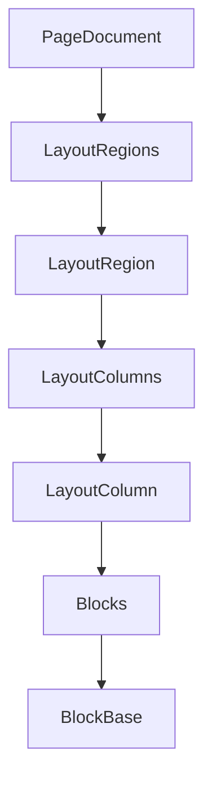

# Aero CMS - Page Editor Reference

This document provides a technical overview of the Aero CMS Page Editor, covering its frontend architecture, backend block system, and data models.

## 🎨 Frontend Architecture (`/manager/aero-cms`)

The frontend is a sophisticated, single-page application that provides a drag-and-drop experience for page building.

### Core Technologies
- **Alpine.js**: Handles UI state, block management, and reactivity.
- **Vanilla CSS**: Provides a premium, dark-mode aesthetic using CSS variables for consistent theming.
- **TinyMCE**: Powers the rich text editing capabilities within the `content` block type.
- **HTML5 Drag & Drop API**: Enables intuitive reordering and adding of blocks.

### Key Components
- **`index.html`**: Defines the main layout, including the sidebar (block library) and the central editor canvas.
- **`app.js`**: Contains the `cmsEditor` object which manages the state of the current page, including:
    - `pageTitle`: Title of the page being edited.
    - `blocks`: An array of block objects that represent the page content.
    - `mediaLibrary`: A mocked collection of media assets for selection.
    - `referenceData`: Mocked data for linking to other pages, posts, authors, etc.

### Block Logic
- **Adding Blocks**: Blocks are added via `addBlock(type)`, which initializes a new object with the correct properties for that specific type.
- **Nesting**: The `columns` block type contains its own `columns` array, each with its own `blocks` array, allowing for complex layout structures.
- **Preview Mode**: A toggle allows switching to a read-only preview mode that supports Desktop, Tablet, and Mobile viewport simulations.

---

## ⚙️ Backend Block System (`/src/Aero.Cms.Core/Blocks`)

The backend is built for high-performance content delivery and type-safe extensibility.

### Polymorphic Serialization
The system uses **polymorphic JSON serialization** to handle the diverse set of block types. Each concrete block class is registered with a unique `$blockType` discriminator.

```csharp
[JsonPolymorphic(TypeDiscriminatorPropertyName = "$blockType")]
[JsonDerivedType(typeof(RichTextBlock), "rich_text")]
[JsonDerivedType(typeof(HeroBlock), "hero")]
[JsonDerivedType(typeof(ColumnsBlock), "columns")]
// ... more types
public abstract class BlockBase : Entity, IBlock { ... }
```

### Key Classes & Models
- **`BlockBase`**: The abstract base class for all blocks.
- **`ConcreteBlocks.cs`**: Implements standard blocks like `RichTextBlock`, `HeadingBlock`, `ImageBlock`, and `QuoteBlock`.
- **`LayoutBlocks.cs`**: Defines `ColumnsBlock` and `CardBlock` for complex grid layouts.
- **`BlockMetadataAttribute`**: Used to decorate block classes with display names, categories, and icons for automatic discovery in the editor.

---

## 📄 Data Representation (`/src/Aero.Cms.Modules.Pages`)

### Page Structure
A page is represented by the `PageDocument` entity, which is designed for storage in **Marten (PostgreSQL)**.

- **`LayoutRegions`**: A `PageDocument` contains a list of `LayoutRegion` objects.
- **Regions & Columns**: Each region contains multiple `LayoutColumn` objects, which in turn contain the list of `BlockBase` instances.



### Persistence Logic
- **Frontend**: Currently saves to `localStorage` as a standalone mockup.
- **Backend**: Persisted via `PageContentService.cs` into Marten document storage.

---

## 🛠️ Block Type Synchronization
The system ensures that frontend components and backend classes remain synchronized.

| Feature | Frontend `type` | Backend `$blockType` | Data Structure |
| :--- | :--- | :--- | :--- |
| **Hero Section** | `hero` | `hero` | `mainText`, `subText`, `backgroundImage` |
| **Rich Text** | `content` | `rich_text` | `Content` (HTML string) |
| **Grid System** | `columns` | `columns` | `Columns` (list of column objects) |
| **Media Asset** | `image` | `image` | `MediaId`, `AltText`, `Caption` |
| **Markdown** | `markdown` | `markdown` | `Content` (raw MD string) |
