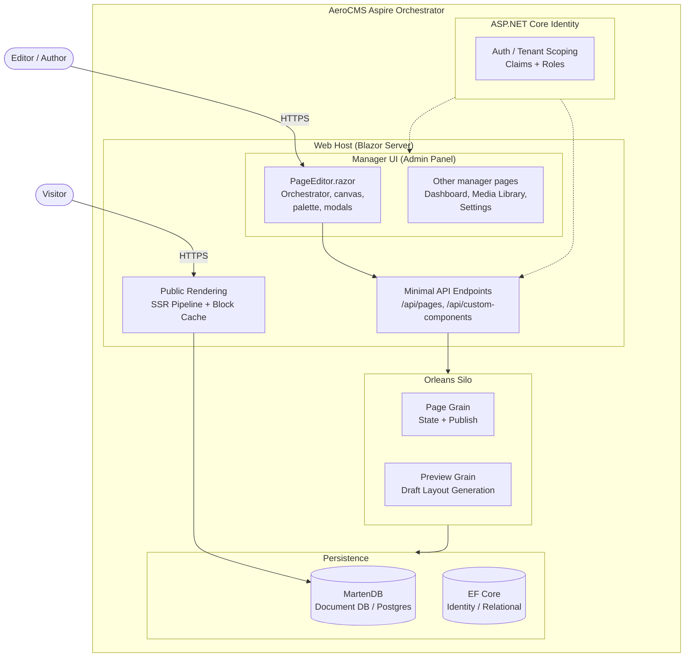
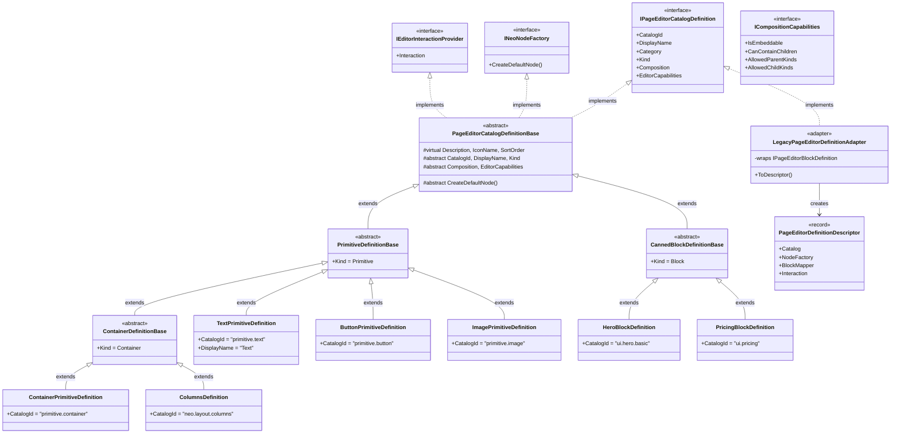
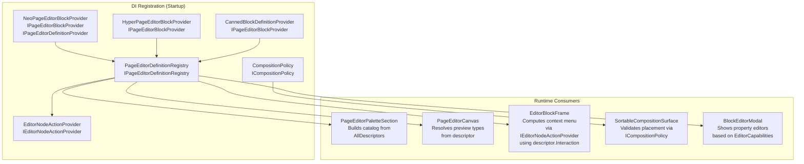
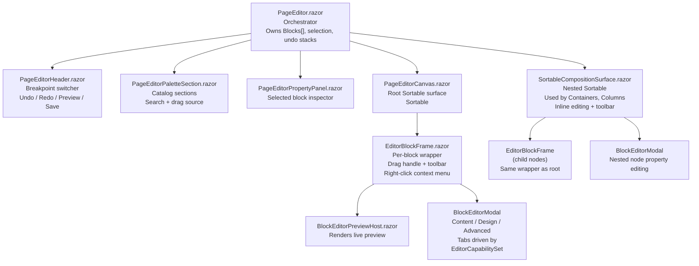
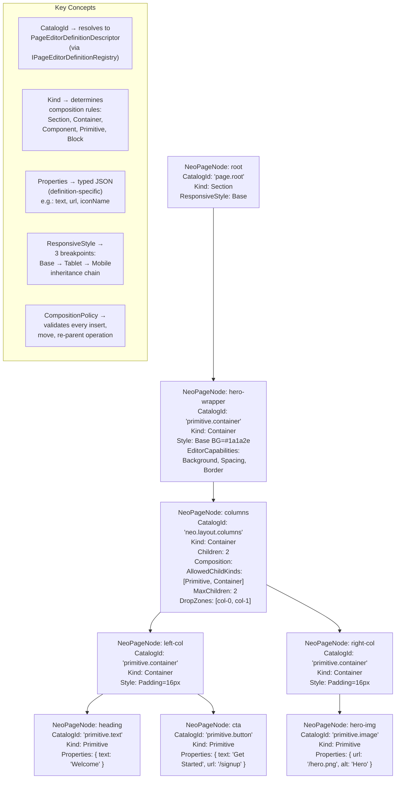
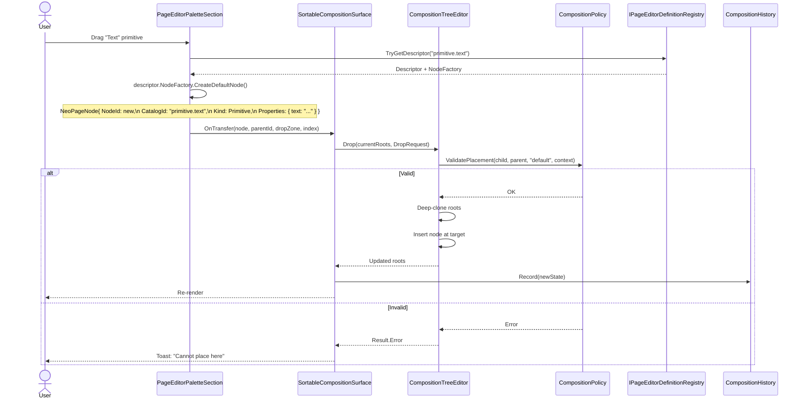
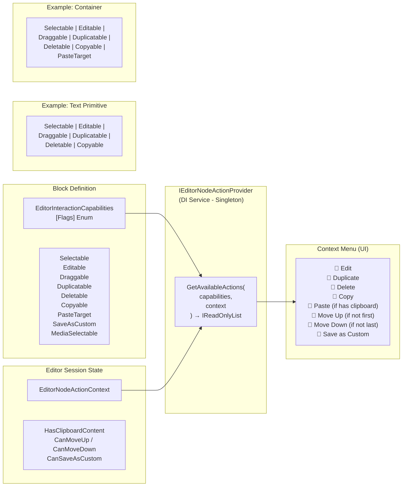
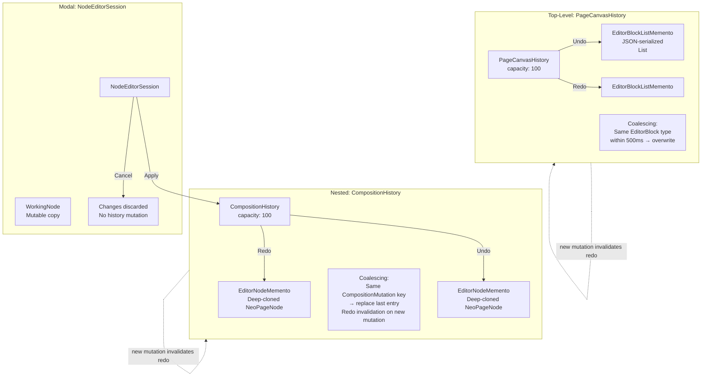
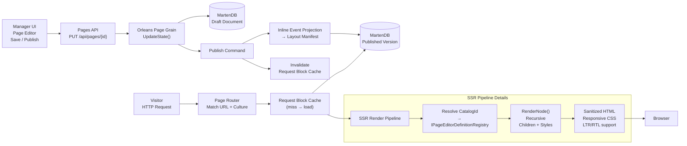

# AeroCMS WYSIWYG Page Editor — Architecture Diagrams

> **Audience:** Stakeholders, engineering leads, new team members  
> **Format:** Mermaid — renders natively in GitHub, GitLab, VS Code, and Bitbucket  
> **Last updated:** 2026-06-16

---

## 1. System Context

How the page editor fits into the AeroCMS application stack.

**Patterns:** *C4 System Context* — shows the Manager UI (hosting the page editor) as one component within a larger distributed system (Orleans grains, MartenDB document store, SSR public rendering).

---

## 2. Class Hierarchy — Definition Inheritance

Every visual element on the canvas — primitives, containers, blocks, custom components — shares a common contract hierarchy.

**Patterns:** *Template Method* (base class defines skeleton, concretes supply values), *Factory Method* (`CreateDefaultNode()`), *Bridge* (interface hierarchy separate from implementation), *Adapter* (LegacyPageEditorDefinitionAdapter bridges old `IPageEditorBlockDefinition` into new catalog).

---

## 3. Service Interaction — DI Wiring

How definitions flow from providers through the registry to editor consumers. One `AddSingleton` call per component; no static state.

**Patterns:** *Dependency Inversion* (consumers depend on `IPageEditorDefinitionRegistry`, not concrete static registry), *Single Responsibility* (providers produce, registry stores, policies decide, UI renders).

---

## 4. Blazor Component Tree

The runtime UI hierarchy. Every block is rendered through the same `EditorBlockFrame` wrapper; nested composition uses `SortableCompositionSurface`.

**Note:** Both root blocks (`EditorBlockFrame`) and nested composition nodes (`SortableCompositionSurface`) use the same `EditorBlockFrame` wrapper, the same `IEditorNodeActionProvider` for context menus, and the same `BlockEditorModal` for property editing. This is the unified interaction path.

---

## 5. Composition Data Model — NeoPageNode Tree

Every page is a tree of `NeoPageNode` instances. Each node carries a `CatalogId` (resolves to a definition), a `Kind` (composition role), typed `Properties` (JSON), responsive `Style`, and optional `Children`.

**Patterns:** *Composite* (tree of nodes, uniform treatment of leaves and containers), *Strategy* (definition selected by `CatalogId`).

---

## 6. Block Editing Flow — Palette to Canvas

Sequence for dragging a primitive from the palette into a container on the canvas.

**Patterns:** *Command* (DropRequest encapsulates mutation), *Strategy* (Policy selects validation rules by definition), *Memento* (History stores deep-clone snapshots).

---

## 7. Interaction Capabilities — Context Menu Strategy

Canvas actions are not hardcoded per block type. Each definition declares its allowed interactions via flags; a central provider resolves the current menu based on flags + runtime state.

**Patterns:** *Strategy* (action provider algorithm is swappable), *Interface Segregation* (interaction flags separate from property editor capabilities), *Open/Closed* (adding a new block type adds a definition, not a switch case).

---

## 8. Undo / Redo — Command + Memento

Two history systems handle different scope levels. Both use the Memento pattern (deep-clone snapshots) with bounded capacity.

**Patterns:** *Command* (each user action is a discrete mutation), *Memento* (snapshots capture full state for undo/redo), *Coalescing* (rapid sequential mutations of the same type merge into one undo step).

---

## 9. Public Rendering Pipeline

From Manager UI save to visitor's browser. The composition tree flows through Orleans grains, MartenDB projections, and the SSR pipeline.

**Patterns:** *Strategy* (renderer selected by `CatalogId`), *Observer* (publish event → projection + cache invalidation), *Chain of Responsibility* (cache → load → resolve → render → emit).

---

## Pattern Reference Summary

| GoF Pattern | Where Applied |
|---|---|
| **Composite** | `NeoPageNode` tree — uniform treatment of leaf nodes and containers |
| **Command** | Every user mutation: `CompositionDropRequest`, undo/redo actions |
| **Memento** | `EditorNodeMemento`, `EditorBlockListMemento` — snapshot-based undo/redo |
| **Strategy** | `ICompositionPolicy`, `IEditorNodeActionProvider`, renderer selection by CatalogId |
| **Template Method** | `PageEditorCatalogDefinitionBase` skeleton → concrete overrides |
| **Factory Method** | `INeoNodeFactory.CreateDefaultNode()` — each definition creates its own default |
| **Adapter** | `LegacyPageEditorDefinitionAdapter` — bridges old `IPageEditorBlockDefinition` |
| **Bridge** | Interface hierarchy (catalog) separate from implementation hierarchy (services) |
| **Observer** | Publish event triggers inline projection + cache invalidation |
| **Chain of Responsibility** | Public request: cache → MartenDB → resolve → render → emit |
| **Single Responsibility** | Each service owns one concern: registry stores, policy validates, provider builds |

---

## SOLID Principles Applied

| Principle | How |
|---|---|
| **S** | `IPageEditorDefinitionRegistry` stores; `ICompositionPolicy` validates; `IEditorNodeActionProvider` builds menus; renderers render; editors edit |
| **O** | New block type = new concrete class + optional provider registration. No switch cases |
| **L** | Any `IPageEditorCatalogDefinition` implementation is a valid canvas participant |
| **I** | `EditorInteractionCapabilities` separate from `EditorCapabilitySet`; `INeoNodeFactory` separate from `INeoNodeBlockMapper` |
| **D** | UI depends on `IPageEditorDefinitionRegistry`, not a concrete static class |

---

*Generated from the AeroCMS codebase at `src/Aero.Cms.Abstractions/Blocks/Editor/`, `src/Aero.Cms.Shared/Pages/Manager/PageEditor/`, and `docs/ux-refactor.md`.*
