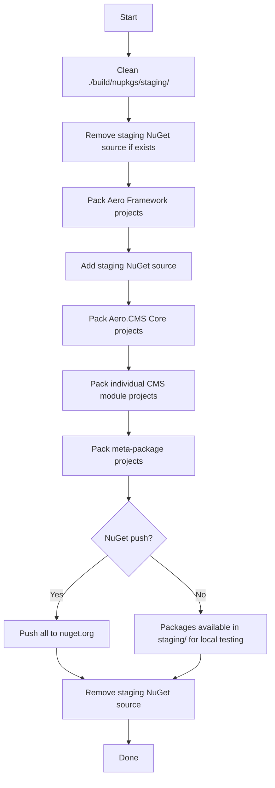

> [!IMPORTANT]
> **STORAGE SUPERSEDED — MARTEN IS NO LONGER USED.** The backend database is now
> **SurrealDB via AeroDB.Sable** (embedded SurrealKV or remote server). Marten
> was migrated out in [`surrealdb-marten-port.md`](surrealdb-marten-port.md).
> This document is a historical implementation record; its Marten/PostgreSQL
> persistence details do not reflect the current stack.

# NuGet Packaging Implementation Plan

> Status: Draft  
> Version: 0.0.5-alpha (pre-release)  
> Author: Ops / Platform Team  
> Last Updated: 2026-06-14

---

## Table of Contents

1. [Overview](#1-overview)
2. [Solution Layout & Scope](#2-solution-layout--scope)
3. [NuGet Package Inventory](#3-nuget-package-inventory)
   - [3.1 Aero Framework (19 packages)](#31-aero-framework-19-packages)
   - [3.2 Aero.CMS Core Libraries (17 packages)](#32-aerocms-core-libraries-17-packages)
   - [3.3 Individual CMS Modules (60 packages)](#33-individual-cms-modules-60-packages)
   - [3.4 CMS Module Meta-Packages (7 packages)](#34-cms-module-meta-packages-7-packages)
    - [3.5 NeoUI (excluded — third-party packages)](#35-neoui-excluded--third-party-packages)
4. [Projects NOT Packaged](#4-projects-not-packaged)
5. [Versioning Strategy](#5-versioning-strategy)
6. [Source Generators Packaging](#6-source-generators-packaging)
7. [Dual-Mode References Strategy](#7-dual-mode-references-strategy)
8. [MSBuild Configuration Details](#8-msbuild-configuration-details)
9. [Publish Script Specification](#9-publish-script-specification)
10. [NuGet Feed & Consumption](#10-nuget-feed--consumption)
11. [CI/CD Integration](#11-cicd-integration)
    - [11.1 Trusted Publishing (OIDC)](#111-authentication-nuget-trusted-publishing-oidc)
    - [11.2 Preview Workflow](#112-preview-workflow--auto-publish-from-develop)
    - [11.3 Release Workflow](#113-release-workflow--gated-publish-from-release)
    - [11.7 Required GitHub Secrets](#117-required-github-secrets)
12. [Migration Steps](#12-migration-steps)
    - [Step 7: Set Up Trusted Publishing](#step-7-set-up-trusted-publishing-on-nugetorg)
    - [Step 8: Create GitHub Environments](#step-8-create-github-environments)
    - [Step 9: Push First Pre-release](#step-9-push-first-pre-release)
13. [Open Questions & Risks](#13-open-questions--risks)
14. [Appendix A: Full csproj config templates](#14-appendix-a-full-csproj-config-templates)
15. [Appendix B: Complete Module-to-Meta-Package Mapping](#15-appendix-b-complete-module-to-meta-package-mapping)

---

## 1. Overview

This document defines the complete plan for producing NuGet pre-release packages (v0.0.5-alpha) from the AeroCMS monorepo. The repository contains **131 `.csproj` files** across three solution roots:

| Solution Root | Path | Project Count | Description |
|---|---|---|---|
| **Aero Framework** | `Aero/src/` | 19 library + 12 test | Foundational libraries (git submodule) |
| **Aero.CMS** | `src/` | ~80 library + module + host + 6 test | CMS application and feature modules |
| **NeoUI** | `NeoUI/src/` | 5 library + 5 demo | Blazor component library (third-party submodule, already published externally — excluded) |

### Goals

1. Publish reusable libraries as NuGet pre-release packages under the `Aero.*` and `Aero.Cms.*` namespaces (NeoUI is a third-party submodule, already published externally by its maintainer).
2. Allow consumers to install the CMS into existing ASP.NET Core applications via the bootstrap package (`Aero.Cms.AspNetCore`).
3. Allow granular install of individual feature modules, or bulk install via meta-packages.
4. Keep local development using `<ProjectReference>` for fast iteration.
5. Automate the packaging and publishing pipeline via a single script.

### Non-Goals

- Publishing application shells (web host, MAUI hybrid, WASM client, Aspire orchestrator, Orleans server).
- Publishing test projects.
- Packaging or modifying NeoUI (third-party submodule, already published externally by its maintainer).
- Versioning beyond pre-release before v1.0.

---

## 2. Solution Layout & Scope

```
D:\proj\microbians\AeroCMS\
├── Aero/                          ← Git submodule
│   └── src/
│       ├── Aero.Core/
│       ├── Aero.Models/
│       ├── Aero.Actors.Abstractions/
│       ├── Aero.Actors/
│       ├── Aero.Auth/
│       ├── Aero.Caching/
│       ├── Aero.Cloudflare/       ← EXE, skip
│       ├── Aero.Core.Ai/
│       ├── Aero.EfCore/
│       ├── Aero.Events/
│       ├── Aero.Marten/
│       ├── Aero.MerakiUI/
│       ├── Aero.Modular/
│       ├── Aero.Secrets/
│       ├── Aero.Services/
│       ├── Aero.SignalR/
│       ├── Aero.Validators/
│       ├── Aero.Web/
│       ├── Aero.Social/
│       └── Aero.Social.Twitter.Client/
├── src/                           ← CMS (this repo)
│   ├── Aero.Cms/                  ← MAUI EXE, skip
│   ├── Aero.Cms.Web/              ← Web host, skip
│   ├── Aero.Cms.Web.Client/       ← WASM host, skip
│   ├── Aero.Cms.Web.Core/
│   ├── Aero.Cms.Web.Bootstrap/
│   ├── Aero.Cms.Core/
│   ├── Aero.Cms.Core.Abstractions/ (empty placeholder)
│   ├── Aero.Cms.Abstractions/
│   ├── Aero.Cms.Contracts/
│   ├── Aero.Cms.Core.Entities/
│   ├── Aero.Cms.Data/
│   ├── Aero.Cms.Services/
│   ├── Aero.Cms.Shared/
│   ├── Aero.Cms.Shared.Models/   (empty placeholder)
│   ├── Aero.Cms.Marten.Identity/
│   ├── Aero.Cms.SourceGenerators/
│   ├── Aero.Cms.Generated.Json/  ← build artifact, skip
│   ├── Aero.Cms.ServiceDefaults/
│   ├── Aero.Cms.Jobs/
│   ├── Aero.Cms.CookiePolicy/
│   ├── Aero.Cms.Ui.Neo/
│   ├── Aero.Cms.Ui.Hyper/
│   ├── Aero.Cms.Modules.Abstraction/
│   ├── Aero.Cms.Modules.*/       ← 60 module projects
│   ├── Aero.Cms.AppHost/         ← Aspire host, skip
│   ├── Aero.AppServer/           ← Orleans server, skip
│   ├── TestModule/               ← placeholder, skip
│   └── manager/                  ← CLI tool, skip
├── NeoUI/                         ← Third-party submodule (already published externally)
│   └── src/
│       ├── NeoUI.Blazor/
│       ├── NeoUI.Blazor.Primitives/
│       ├── NeoUI.Icons.Lucide/
│       ├── NeoUI.Icons.Heroicons/
│       └── NeoUI.Icons.Feather/
├── tests/                         ← CMS test projects (skip)
├── docs/
└── build/
```

---

## 3. NuGet Package Inventory

### 3.1 Aero Framework (19 packages)

All projects in `Aero/src/` share `Aero/src/Directory.Build.props` with:
- `Version=0.0.5-alpha`
- `Authors=Troy Robinson, et al`
- `PackageLicenseExpression=Apache-2.0`
- `IncludeSymbols=true`, `SymbolPackageFormat=snupkg`
- `GenerateDocumentationFile=true`

| # | PackageId | Description | Current IsPackable | Depends On (ProjectReferences) |
|---|---|---|---|---|
| 1 | `Aero.Core` | Core utility tools | `false` → `true` | (none — leaf) |
| 2 | `Aero.Models` | Common models | `false` → `true` | (none — leaf, or minimal) |
| 3 | `Aero.Actors.Abstractions` | Orleans actor abstractions | unset → `true` | `Microsoft.Orleans.Sdk` |
| 4 | `Aero.Actors` | Orleans actor implementations | `false` → `true` | Aero.Core, Aero.Models |
| 5 | `Aero.Auth` | Authentication services (RCL) | `false` → `true` | Aero.Core, Aero.Marten, Aero.Services, Aero.Validators, Aero.Web |
| 6 | `Aero.Caching` | Caching utils (Redis, FusionCache) | `false` → `true` | Aero.Core |
| 7 | `Aero.Core.Ai` | AI integration | unset → `true` | Aero.Core |
| 8 | `Aero.EfCore` | Entity Framework Core persistence | unset → `true` | Aero.Marten, Aero.Models, Aero.Core |
| 9 | `Aero.Events` | Event foundations (WolverineFx, Azure SB, RabbitMQ) | `false` → `true` | Aero.Core, Aero.Models |
| 10 | `Aero.Marten` | MartenDB persistence + GenericMartenRepository | `false` → `true` | Aero.Auth, Aero.Caching, Aero.Core, Aero.Models |
| 11 | `Aero.MerakiUI` | Meraki UI Blazor components | `false` → `true` | (RCL, various component deps) |
| 12 | `Aero.Modular` | Modular system | unset → `true` | Aero.Cms.Abstractions |
| 13 | `Aero.Secrets` | Secrets management (Infisical) | unset → `true` | Aero.Core |
| 14 | `Aero.Services` | Common services (email, JWT, Twilio) | unset → `true` | Aero.Core, Aero.Models |
| 15 | `Aero.SignalR` | SignalR hubs | `false` → `true` | Aero.Core |
| 16 | `Aero.Validators` | Validation (FluentValidation) | `false` → `true` | Aero.Core |
| 17 | `Aero.Web` | Common web services (auth, OAuth, Scalar, Mapster) | `false` → `true` | Aero.Core, Aero.Services, Aero.Validators, Aero.Models |
| 18 | `Aero.Social` | Social services base | unset → `true` | Aero.Core |
| 19 | `Aero.Social.Twitter.Client` | Twitter/X API client | unset → `true` | Aero.Core |

**Excluded from Aero Framework:**
- `Aero.Cloudflare` → `OutputType=Exe`, not a library

### 3.2 Aero.CMS Core Libraries (17 packages)

These are the shared/infrastructure library projects under `src/` that form the CMS platform. They share `src/Directory.Build.props` with:
- `Version=0.0.5-alpha`
- `Authors=Aero Cms`
- `PackageLicenseExpression=MIT`
- `IncludeSymbols=true`, `SymbolPackageFormat=snupkg`

| # | PackageId | Description | Current IsPackable | Notes |
|---|---|---|---|---|
| 1 | `Aero.Cms.Abstractions` | Core DTOs, interfaces, Orleans grain interfaces | unset → `true` | Heavy: Orleans, Marten, FluentValidation, Mapster |
| 2 | `Aero.Cms.Contracts` | Contract interfaces and DTOs | unset → `true` | Light: Aero.Core + logging |
| 3 | `Aero.Cms.Core.Entities` | Core entity types | unset → `true` | Aero.Core + Aero.Cms.Abstractions |
| 4 | `Aero.Cms.Core` | CMS core infrastructure (RCL) | unset → `true` | Marten, Scriban, WolverineFx, Scrutor. SDK=Razor |
| 5 | `Aero.Cms.Data` | Data access layer | unset → `true` | Aero.Core, Aero.EfCore, Aero.Models, Aero.Cms.Abstractions, Aero.Cms.Core.Entities |
| 6 | `Aero.Cms.Services` | Service layer | unset → `true` | Aero.Core, Aero.EfCore, Aero.Events, Aero.Marten, Aero.Services, Aero.Validators, Aero.Cms.Abstractions, Aero.Cms.Core.Entities, Aero.Cms.Data |
| 7 | `Aero.Cms.Shared` | Shared Razor components (RCL) | unset → `true` | Radzen, NeoUI.Blazor, BlazorMonaco, Markdig. SDK=Razor |
| 8 | `Aero.Cms.Marten.Identity` | Marten-backed ASP.NET Identity | unset → `true` | Marten, Microsoft.Extensions.Identity.Core |
| 9 | `Aero.Cms.SourceGenerators` | C# Source Generators (analyzer) | `false` → `true` | **Special packaging** — see §6 |
| 10 | `Aero.Cms.Web.Core` | Web core infrastructure (RCL) | unset → `true` | Aero.Core, Aero.EfCore, Aero.Marten, Aero.Models, Aero.Modular, Aero.Services, Aero.Web, Aero.Cms.Core, Aero.Cms.Modules.Modules, Aero.Cms.Shared. SDK=Razor |
| 11 | `Aero.Cms.Web.Bootstrap` | **Package-first ASP.NET Core integration** | **`true`** | PackageId = `Aero.Cms.AspNetCore`. Already ready. Bundles ~70 ProjectReferences. |
| 12 | `Aero.Cms.ServiceDefaults` | Aspire service defaults (OpenTelemetry, Resilience) | unset → `true` | IsAspireSharedProject |
| 13 | `Aero.Cms.Jobs` | Background jobs support (RCL) | unset → `true` | Aero.Cms.Core |
| 14 | `Aero.Cms.CookiePolicy` | Cookie consent / GDPR (RCL) | unset → `true` | Aero.Cms.Core. Note: not currently a module pattern — lives at root `src/`. |
| 15 | `Aero.Cms.Ui.Neo` | Neo UI theme (RCL) | unset → `true` | Radzen, NeoUI.Blazor, Aero.Cms.Abstractions, Aero.Cms.Shared |
| 16 | `Aero.Cms.Ui.Hyper` | Hyper UI theme (RCL) | unset → `true` | Aero.Cms.Abstractions, Aero.Cms.Shared |
| 17 | `Aero.Cms.Modules.Abstraction` | Module abstraction base | unset → `true` | Currently empty — placeholder for shared module interfaces |

**Note on empty placeholders:**
- `Aero.Cms.Core.Abstractions` — empty project, skip packaging
- `Aero.Cms.Shared.Models` — empty project, skip packaging

### 3.3 Individual CMS Modules (60 packages)

Each CMS feature module under `src/Aero.Cms.Modules.*` (except `Aero.Cms.Modules.Abstraction`) will be packaged as an individual NuGet package. This allows granular installs.

**Complete list of individual module packages:**

```
Aero.Cms.Modules.Ai
Aero.Cms.Modules.AiAssistant
Aero.Cms.Modules.Aliases
Aero.Cms.Modules.Analytics
Aero.Cms.Modules.Audit
Aero.Cms.Modules.Banner
Aero.Cms.Modules.Blog.Importer
Aero.Cms.Modules.Cache
Aero.Cms.Modules.Chat
Aero.Cms.Modules.Commerce
Aero.Cms.Modules.Commerce.Client
Aero.Cms.Modules.Content
Aero.Cms.Modules.Crm
Aero.Cms.Modules.Docs
Aero.Cms.Modules.Export
Aero.Cms.Modules.Footer
Aero.Cms.Modules.Forum
Aero.Cms.Modules.Grpc
Aero.Cms.Modules.Health
Aero.Cms.Modules.Headless
Aero.Cms.Modules.Identity
Aero.Cms.Modules.Jobs
Aero.Cms.Modules.Jwt
Aero.Cms.Modules.LettuceEncrypt
Aero.Cms.Modules.Localization
Aero.Cms.Modules.Logging
Aero.Cms.Modules.MagicLink
Aero.Cms.Modules.Mail
Aero.Cms.Modules.Mailer
Aero.Cms.Modules.Manager
Aero.Cms.Modules.Mcp
Aero.Cms.Modules.Media
Aero.Cms.Modules.Members
Aero.Cms.Modules.MiniProfiler
Aero.Cms.Modules.Modules
Aero.Cms.Modules.Navigation
Aero.Cms.Modules.OneTimePasscode
Aero.Cms.Modules.OpenTelemetry
Aero.Cms.Modules.OutputCache
Aero.Cms.Modules.Pages
Aero.Cms.Modules.Posts
Aero.Cms.Modules.RateLimiting
Aero.Cms.Modules.RequestLog
Aero.Cms.Modules.Rewrite
Aero.Cms.Modules.Scalar
Aero.Cms.Modules.Search
Aero.Cms.Modules.Secrets
Aero.Cms.Modules.Security
Aero.Cms.Modules.Settings
Aero.Cms.Modules.Setup
Aero.Cms.Modules.SimpleSecurity
Aero.Cms.Modules.SiteMap
Aero.Cms.Modules.Sites
Aero.Cms.Modules.Static
Aero.Cms.Modules.Tcp
Aero.Cms.Modules.Tenant
Aero.Cms.Modules.Theming
Aero.Cms.Modules.Users
Aero.Cms.Modules.WebOptimizer
Aero.Cms.Modules.WorkOS
```

**PackageId convention:** The `PackageId` for each module matches its project name (e.g., `Aero.Cms.Modules.Content`).

**Dependencies:** Each module's csproj already specifies its `<ProjectReference>` dependencies. When packed, these become NuGet dependencies on the corresponding packages (provided those packages are pushed first; see §7).

### 3.4 CMS Module Meta-Packages (7 packages)

Meta-packages are **empty packages** containing only NuGet dependencies on individual module packages. They have no code, no DLLs. Their purpose is to let consumers install an entire category of modules with a single package reference.

| Meta-Package | Included Module Packages | Purpose |
|---|---|---|
| `Aero.Cms.Modules.Core` | Content, Pages, Posts, Media, Navigation, Sites, Theming, Settings, Cache, Health, Logging, OpenTelemetry, OutputCache, RateLimiting, RequestLog, Rewrite, Security, SimpleSecurity, SiteMap, Static, WebOptimizer, Footer, Banner | Core CMS functionality every site needs |
| `Aero.Cms.Modules.Identity` | Identity, Jwt, MagicLink, Members, OneTimePasscode, Users, Secrets, WorkOS | Authentication and user management |
| `Aero.Cms.Modules.Commerce` | Commerce, Commerce.Client | E-commerce capabilities |
| `Aero.Cms.Modules.Communication` | Mail, Mailer, Chat, Forum, Analytics, Crm, Audit | Communication and engagement |
| `Aero.Cms.Modules.Management` | Manager, Modules, Setup, Jobs, Export, Aliases, Localization | Admin and management tooling |
| `Aero.Cms.Modules.Docs` | Docs, Blog.Importer, Ai, AiAssistant, Search | Documentation and AI features |
| `Aero.Cms.Modules.Infrastructure` | Grpc, Headless, LettuceEncrypt, Mcp, MiniProfiler, Scalar, Tcp | Infrastructure and protocol support |

**Meta-package csproj template:**

```xml
<Project Sdk="Microsoft.NET.Sdk">
  <PropertyGroup>
    <TargetFramework>net10.0</TargetFramework>
    <ImplicitUsings>enable</ImplicitUsings>
    <Nullable>enable</Nullable>
    <IsPackable>true</IsPackable>
    <PackageId>Aero.Cms.Modules.Core</PackageId>
    <Version>0.0.5-alpha</Version>
    <Title>Aero CMS Core Modules Meta-Package</Title>
    <Description>Meta-package containing all core CMS modules: Content, Pages, Posts, Media, Navigation, Sites, Theming, Settings, and more.</Description>
    <IncludeBuildOutput>false</IncludeBuildOutput>
    <IncludeSymbols>false</IncludeSymbols>
    <SuppressDependenciesWhenPacking>false</SuppressDependenciesWhenPacking>
    <NoDefaultExcludes>true</NoDefaultExcludes>
  </PropertyGroup>

  <ItemGroup>
    <PackageReference Include="Aero.Cms.Modules.Content" Version="0.0.5-alpha" />
    <PackageReference Include="Aero.Cms.Modules.Pages" Version="0.0.5-alpha" />
    <PackageReference Include="Aero.Cms.Modules.Posts" Version="0.0.5-alpha" />
    <PackageReference Include="Aero.Cms.Modules.Media" Version="0.0.5-alpha" />
    <!-- ... remaining module references ... -->
  </ItemGroup>
</Project>
```

### 3.5 NeoUI (excluded — third-party packages)

NeoUI is a git submodule (`NeoUI/`) that is **already published as NuGet packages by an external maintainer** (Jimmy Petrus / BlazorUI). It has its own MinVer-based pipeline and its own release cadence. We consume NeoUI via `<PackageReference>` in our projects (e.g., `NeoUI.Blazor`, `NeoUI.Icons.Lucide`), not from source.

**No changes needed — we do not package or publish NeoUI from this repository.**

---

## 4. Projects NOT Packaged

These are application shells, executable projects, build artifacts, and test projects that should **never** be published to NuGet.

| Project | Reason |
|---|---|
| `Aero.Cms` | MAUI Hybrid app (EXE, multi-target: android/ios/win) |
| `Aero.Cms.Web` | ASP.NET Core web host |
| `Aero.Cms.Web.Client` | Blazor WebAssembly client app |
| `Aero.Cms.AppHost` | .NET Aspire orchestrator |
| `Aero.AppServer` | Orleans silo/server process |
| `Aero.Cloudflare` | Cloudflare Worker (EXE) |
| `manager` | CLI tool (EXE) |
| `TestModule` | Developer placeholder |
| `Aero.Cms.Generated.Json` | Build-time artifact (auto-generated STJ contexts) |
| `Aero.Cms.Core.Abstractions` | Empty placeholder project |
| `Aero.Cms.Shared.Models` | Empty placeholder project |
| All `Aero/Tests/*` (12 projects) | Test projects (TUnit) |
| All `tests/*` (6 projects) | Test projects (TUnit, Alba) |
| All `NeoUI/*` (10 projects) | Third-party submodule, already published externally by its maintainer |

---

## 5. Versioning Strategy

### Baseline

All packages share a unified version: **`0.0.5-alpha`** throughout the pre-release phase.

### Version Source

Both `Aero/src/Directory.Build.props` and `src/Directory.Build.props` define:

```xml
<Version>0.0.5-alpha</Version>
```

This is inherited by all projects in their respective subtrees. No per-project version overrides are needed.

### Pre-release Label

- Keep `-alpha` for the current development phase.
- If the pre-release label needs to change in the future (e.g., `-beta.1`, `-preview.1`, `-rc.1`), update it in both `Directory.Build.props` files.

### Version Bumping

1. **During active development:** Increment the patch version (e.g., `0.0.6-alpha`, `0.0.7-alpha`) as needed for publishing fixes.
2. **Pre-release iterations:** Use NuGet's SemVer 2.0 pre-release labels for iteration within a single version, e.g., `0.0.5-alpha.1`, `0.0.5-alpha.2`.
3. **First stable:** `1.0.0`.

### Version Pinning in Dependencies

All `PackageReference` entries in meta-packages and between CMS modules must pin the exact same version (`0.0.5-alpha`) to ensure consistency. This is managed by `Directory.Packages.props` (Central Package Management).

---

## 6. Source Generators Packaging

`Aero.Cms.SourceGenerators` is a Roslyn source generator targeting `netstandard2.0`. It must be packaged as a **NuGet analyzer** so it executes automatically when the consuming project restores the package.

### Current Configuration

```xml
<Project Sdk="Microsoft.NET.Sdk">
  <PropertyGroup>
    <TargetFramework>netstandard2.0</TargetFramework>
    <LangVersion>latest</LangVersion>
    <ImplicitUsings>enable</ImplicitUsings>
    <Nullable>enable</Nullable>
    <IsPackable>false</IsPackable>               <!-- Needs to change -->
    <IncludeBuildOutput>false</IncludeBuildOutput>
    <EnforceExtendedAnalyzerRules>true</EnforceExtendedAnalyzerRules>
    <NoWarn>$(NoWarn);RS2008</NoWarn>
  </PropertyGroup>
  <ItemGroup>
    <PackageReference Include="Microsoft.CodeAnalysis.CSharp" PrivateAssets="all" />
  </ItemGroup>
</Project>
```

### Required Changes for NuGet Analyzer Packaging

Per the [Microsoft analyzer conventions](https://learn.microsoft.com/nuget/guides/analyzers-conventions), source generator DLLs must be placed in the `analyzers/dotnet/cs` folder within the nupkg. The `.nuspec` equivalent structure is:

```
analyzers/dotnet/cs/Aero.Cms.SourceGenerators.dll
```

**New configuration:**

```xml
<Project Sdk="Microsoft.NET.Sdk">
  <PropertyGroup>
    <TargetFramework>netstandard2.0</TargetFramework>
    <LangVersion>latest</LangVersion>
    <ImplicitUsings>enable</ImplicitUsings>
    <Nullable>enable</Nullable>
    <IsPackable>true</IsPackable>
    <IncludeBuildOutput>false</IncludeBuildOutput>
    <SuppressDependenciesWhenPacking>true</SuppressDependenciesWhenPacking>
    <DevelopmentDependency>true</DevelopmentDependency>
    <EnforceExtendedAnalyzerRules>true</EnforceExtendedAnalyzerRules>
    <NoWarn>$(NoWarn);RS2008</NoWarn>

    <!-- NuGet metadata (inherited from Directory.Build.props, but ensure these are set) -->
    <PackageId>Aero.Cms.SourceGenerators</PackageId>
    <Version>0.0.5-alpha</Version>
    <Title>Aero CMS Source Generators</Title>
    <Description>Roslyn source generators for Aero CMS module discovery, Wolverine handler registration, block renderer registration, and content type generation.</Description>
    <PackageTags>source-generator;analyzers;roslyn;aero-cms</PackageTags>
    <PackageLicenseExpression>MIT</PackageLicenseExpression>
  </PropertyGroup>

  <ItemGroup>
    <PackageReference Include="Microsoft.CodeAnalysis.CSharp" Version="4.*" PrivateAssets="all" />
  </ItemGroup>

  <!-- Pack the source generator DLL into the analyzers/dotnet/cs folder -->
  <ItemGroup>
    <None Include="$(OutputPath)\$(AssemblyName).dll"
          Pack="true"
          PackagePath="analyzers/dotnet/cs"
          Visible="false" />
  </ItemGroup>
</Project>
```

### Key Points

- **`<IncludeBuildOutput>false</IncludeBuildOutput>`** — no lib/ folder in the package (source generators don't ship runtime assemblies).
- **`<SuppressDependenciesWhenPacking>true</SuppressDependenciesWhenPacking>`** — prevents `Microsoft.CodeAnalysis.CSharp` from becoming a NuGet dependency (it's a build-time dependency only).
- **`<DevelopmentDependency>true</DevelopmentDependency>`** — prevents the package from being listed as a transitive dependency.
- **`PackagePath="analyzers/dotnet/cs"`** — the standard NuGet analyzer convention. The DLL is automatically loaded as an analyzer when a project references this package.

### Consumer Experience

When a project installs `Aero.Cms.SourceGenerators`, the DLL is automatically available as a Roslyn analyzer. The source generators activate when their conditions are met:

- **ModuleManifestGenerator** — activates when `[Module]` attribute is found
- **WolverineHandlerGenerator** — activates when `[WolverineHandler]` attribute is found
- **HostModuleCatalogGenerator** — activates when `ModuleManifestProviderAttribute` assembly attributes are detected

No additional `OutputItemType="Analyzer"` configuration is needed in the consuming project — NuGet handles this automatically for packages with `analyzers/dotnet/cs/` content.

### Migration Notes

- Current projects that reference `Aero.Cms.SourceGenerators` via `<ProjectReference OutputItemType="Analyzer" ReferenceOutputAssembly="false">` will need to switch to `<PackageReference>` when consuming from NuGet.
- The development-time experience (ProjectReference) can remain unchanged.

---

## 7. Dual-Mode References Strategy

### The Problem

During development, all Aero.CMS projects reference Aero framework projects via `<ProjectReference>`. This is essential for rapid iteration: changes to Aero.Core are immediately visible to Aero.Cms.Abstractions without re-publishing.

However, when Aero.CMS projects are packed as NuGet packages, there's a subtlety with how `<ProjectReference>` is handled by `dotnet pack`.

**Key fact (per MS Learn):** `dotnet pack` **always** converts `<ProjectReference>` items to NuGet dependency entries in the generated `.nuspec`. It does **not** embed the referenced project's DLL into the consumer's nupkg. The behavior is the same regardless of the referenced project's `<IsPackable>` setting.

This means our ProjectReferences consistently produce correct NuGet dependency metadata. The real problem is **consumer-side dependency resolution**: when a consumer installs `Aero.Cms.AspNetCore` from NuGet, NuGet must also resolve `Aero.Core 0.0.5-alpha`, `Aero.Marten 0.0.5-alpha`, and all other transitive dependencies. If those packages don't exist on any configured NuGet feed, restore fails.

### Recommended Strategy: Build Script with Feed Staging

**Approach:** Keep all `<ProjectReference>` in csproj files permanently. Never switch to dual-mode csproj. Use a build script that stages packages in the correct order, so that each phase's packages are available as feed sources for subsequent phases and — crucially — the final published packages have resolvable dependency graphs.

#### How It Works

1. **All csproj files use `<ProjectReference>` exclusively.** No csproj changes needed for dependency management.

2. **The publish script (`build/pack.ps1`) handles the ordering:**

   ```
   Phase 1: Pack Aero Framework
     dotnet pack Aero/src/Aero.Core          → ./build/nupkgs/staging/
     dotnet pack Aero/src/Aero.Models        → ./build/nupkgs/staging/
     ...
   
   Phase 2: Add staging feed
     dotnet nuget add source ./build/nupkgs/staging/ --name staging-aero
   
   Phase 3: Restore & Pack Aero.CMS Core
     dotnet restore src/Aero.Cms.Abstractions   (resolves Aero.* from staging)
     dotnet pack  src/Aero.Cms.Abstractions     → ./build/nupkgs/staging/
     ...
   
   Phase 4: Restore & Pack CMS Modules
     dotnet restore src/Aero.Cms.Modules.Content
     dotnet pack  src/Aero.Cms.Modules.Content  → ./build/nupkgs/staging/
     ...
   
    Phase 5: Push all to NuGet (handled by GitHub Actions workflows — see §11)
      # No API key management needed. OIDC / Trusted Publishing handles auth.
   ```

3. **For local package testing** (without pushing to nuget.org), the same script can stop after Phase 4, leaving packages in the staging directory for consumption by test projects.

#### Why Not Dual-Mode csproj (NeoUI Pattern)?

The NeoUI pattern uses a `$(UsePackageReferences)` MSBuild property to switch between ProjectReference and PackageReference:

```xml
<ItemGroup Condition="'$(UsePackageReferences)' != 'true'">
  <ProjectReference Include="..\NeoUI.Blazor.Primitives\..." />
</ItemGroup>
<ItemGroup Condition="'$(UsePackageReferences)' == 'true'">
  <PackageReference Include="NeoUI.Blazor.Primitives" Version="4.0.2" />
</ItemGroup>
```

This pattern is **not recommended** for this monorepo because:

| Concern | Dual-Mode csproj | Build Script with Feed Staging |
|---|---|---|
| **Maintenance burden** | Every csproj maintains TWO dependency lists that can drift apart | Single source of truth (ProjectReference in csproj) |
| **Surface area** | ~80 csproj files to modify (18 Aero + 17 CMS core + 60 modules) | 0 csproj changes needed |
| **Version drift** | PackageReference versions hardcoded in each csproj and can get stale | Versions managed centrally in Directory.Packages.props |
| **Iteration speed** | Must update PackageReference versions during pre-release churn | Never touch ProjectReference — re-pack picks up latest |
| **CI complexity** | CI needs to decide which mode to use | CI runs the same script as local builds |
| **New project onboarding** | Every new module must duplicate both dependency lists | Just add ProjectReference as normal |

#### How `dotnet pack` Handles ProjectReferences

Per [MS Learn](https://learn.microsoft.com/nuget/create-packages/select-assemblies-referenced-by-projects), `dotnet pack` **always** converts `<ProjectReference>` to NuGet dependency entries. It does not embed DLLs. The staging feed is **not** needed for pack-time resolution — it's needed for consumer-side restore validation:

1. **Consumer installs `Aero.Cms.AspNetCore`** → NuGet sees a dependency on `Aero.Core 0.0.5-alpha`
2. **NuGet looks for `Aero.Core 0.0.5-alpha`** → needs to find it on a configured feed
3. **Without staging/published packages** → restore fails with NU1101 (package not found)

The staging feed ensures that when we run `dotnet pack` on CMS packages, the generated nuspec files have resolvable dependency entries. After Phase 1 (Aero packages in staging), subsequent phases can validate that dependency resolution works end-to-end by running `dotnet restore` against the staging feed before packing.

### Detailed Publish Flow



### Key Implementation Details

**NuGet.config Source Mapping:** During staging, use a `nuget.config` entry to ensure the staging feed is prioritized over nuget.org for Aero.* and Aero.Cms.* package resolution:

```xml
<packageSources>
  <clear />
  <add key="staging" value="./build/nupkgs/staging/" />
  <add key="nuget.org" value="https://api.nuget.org/v3/index.json" />
</packageSources>
<packageSourceMapping>
  <packageSource key="staging">
    <package pattern="Aero.*" />
    <package pattern="Aero.Cms.*" />
  </packageSource>
  <packageSource key="nuget.org">
    <package pattern="*" />
  </packageSource>
</packageSourceMapping>

**Why this matters:** Package Source Mapping prevents the staging feed from accidentally resolving third-party packages (like `Microsoft.Extensions.*` or `Marten`). Only `Aero.*` and `Aero.Cms.*` packages are resolved from the staging feed; everything else comes from nuget.org.

---

## 8. MSBuild Configuration Details

### 8.1 Base Directory.Build.props (both roots)

**`Aero/src/Directory.Build.props`** (partial, relevant packaging section):

```xml
<PropertyGroup Label="Package information">
  <Version>0.0.5-alpha</Version>
  <Authors>Troy Robinson, et al</Authors>
  <Company>Microbians</Company>
  <Copyright>Copyright (c) 2023-2026 Microbians</Copyright>
  <PackageLicenseExpression>Apache-2.0</PackageLicenseExpression>
  <PackageTags>asp.net efcore Aero</PackageTags>
  <PackageProjectUrl>https://github.com/microbian-systems/Aero</PackageProjectUrl>
  <RepositoryUrl>https://github.com/microbian-systems/Aero</RepositoryUrl>
  <RepositoryType>git</RepositoryType>
  <PublishRepositoryUrl>true</PublishRepositoryUrl>
  <IncludeSymbols>true</IncludeSymbols>
  <SymbolPackageFormat>snupkg</SymbolPackageFormat>
  <EmbedUntrackedSources>true</EmbedUntrackedSources>
  <GenerateDocumentationFile>true</GenerateDocumentationFile>
</PropertyGroup>
```

**`src/Directory.Build.props`** (partial, relevant packaging section):

```xml
<PropertyGroup Label="Package information">
  <Version>0.0.5-alpha</Version>
  <Authors>Aero Cms</Authors>
  <Company>Microbian Systems</Company>
  <Copyright>Copyright (c) 2025 Microbians</Copyright>
  <PackageLicenseExpression>MIT</PackageLicenseExpression>
  <PackageTags>cms mvc razorpages aspnetcore</PackageTags>
  <PackageIcon>../Aero.png</PackageIcon>
  <PackageProjectUrl>https://github.com/microbian-systems/Aero.core</PackageProjectUrl>
  <RepositoryUrl>https://github.com/microbian-systems/Aero.core</RepositoryUrl>
  <RepositoryType>git</RepositoryType>
  <PublishRepositoryUrl>true</PublishRepositoryUrl>
  <IncludeSymbols>true</IncludeSymbols>
  <SymbolPackageFormat>snupkg</SymbolPackageFormat>
  <EmbedUntrackedSources>true</EmbedUntrackedSources>
  <GenerateDocumentationFile>true</GenerateDocumentationFile>
</PropertyGroup>
```

### 8.2 Per-Project Configuration for Aero Framework

Each Aero project currently has individual packaging metadata. The changes needed:

**For projects with `IsPackable=false`** (Aero.Core, Aero.Models, Aero.Actors, Aero.Auth, Aero.Caching, Aero.Events, Aero.Marten, Aero.MerakiUI, Aero.SignalR, Aero.Validators, Aero.Web):

```xml
<!-- Change to: -->
<IsPackable>true</IsPackable>
```

**For projects without explicit `IsPackable`** (Aero.Actors.Abstractions, Aero.Core.Ai, Aero.EfCore, Aero.Modular, Aero.Secrets, Aero.Services, Aero.Social, Aero.Social.Twitter.Client):

```xml
<!-- Add: -->
<IsPackable>true</IsPackable>
```

**For projects with `GeneratePackageOnBuild=true`** (Aero.Core, Aero.EfCore, Aero.Marten):

This setting builds a nupkg on every `dotnet build`. During development, this is wasteful. Consider removing `GeneratePackageOnBuild` from individual projects and relying on the publish script instead. Alternatively, keep it for convenience (the nupkg is small for library projects).

> **Recommendation:** Remove `GeneratePackageOnBuild` from all individual projects. Rely on the publish script for explicit packaging.

### 8.3 Per-Project Configuration for Aero.CMS Core

For each of the 17 core packages, ensure these properties are set:

```xml
<PropertyGroup>
  <IsPackable>true</IsPackable>
</PropertyGroup>
```

Projects without `<PackageId>` should use the project name as the default (NuGet uses `$(AssemblyName)` or `$(MSBuildProjectName)` as the default PackageId, which matches since the csproj filenames match the desired IDs).

### 8.4 Per-Project Configuration for CMS Modules

For each of the ~60 module projects, add:

```xml
<PropertyGroup>
  <IsPackable>true</IsPackable>
  <GeneratePackageOnBuild>false</GeneratePackageOnBuild>
</PropertyGroup>
```

### 8.5 Per-Project Configuration for Meta-Packages

Create new csproj files in a `src/Aero.Cms.Modules.Meta/` directory (or alongside the modules):

```xml
<Project Sdk="Microsoft.NET.Sdk">
  <PropertyGroup>
    <TargetFramework>net10.0</TargetFramework>
    <ImplicitUsings>enable</ImplicitUsings>
    <Nullable>enable</Nullable>
    <IsPackable>true</IsPackable>
    <IncludeBuildOutput>false</IncludeBuildOutput>
    <IncludeSymbols>false</IncludeSymbols>
    <SuppressDependenciesWhenPacking>false</SuppressDependenciesWhenPacking>
    <DevelopmentDependency>false</DevelopmentDependency>
    <NoPackageAnalysis>true</NoPackageAnalysis>
  </PropertyGroup>
</Project>
```

The dependencies are added as `<PackageReference>` items pointing to the individual module packages.

### 8.6 RCL Static Web Assets

Several packages to be published are Razor Class Libraries (RCLs) that include Razor views, components, and static assets. Per [MS Learn](https://learn.microsoft.com/aspnet/core/razor-pages/ui-class?view=aspnetcore-10.0#create-an-rcl-with-static-assets):

> "When packing an RCL, all companion assets in the `wwwroot` folder are automatically included in the package."

**Affected packages (RCLs with SDK=Sdk.Razor):**

| Package | Has `wwwroot/`? |
|---|---|
| `Aero.Cms.Core` | Check |
| `Aero.Cms.Shared` | Check |
| `Aero.Cms.Web.Core` | Check |
| `Aero.Cms.Ui.Neo` | Check |
| `Aero.Cms.Ui.Hyper` | Check |
| `Aero.Cms.Jobs` | Check |
| `Aero.Cms.CookiePolicy` | Check |
| `Aero.MerakiUI` | Check |
| All `Aero.Cms.Modules.*` | Check (many have wwwroot for client assets) |

**No changes needed to csproj** — `wwwroot` content is included automatically by the Razor SDK. But verify:

1. **Static asset paths** — Assets are served at `_content/{PACKAGE ID}/{PATH}`. If an RCL's `PackageId` differs from its assembly name, static asset paths will use the `PackageId`. Ensure component references to static assets use the correct path.
2. **Consumer requirement** — Apps consuming these RCLs via NuGet must call `builder.WebHost.UseStaticWebAssets()` in `Program.cs` when running from build output (not required for published output). Document this in package README.
3. **Asset conflicts** — If multiple RCLs define static assets with the same path under `wwwroot/`, the consuming app's assets take precedence. No special handling needed.

### 8.7 CSProj Changes Summary

| Change | Scope | Estimated Effort |
|---|---|---|
| Set `IsPackable=true` on 19 Aero projects | Each project's csproj | ~20 min |
| Remove `GeneratePackageOnBuild` (optional) | 3 Aero projects | ~5 min |
| Set `IsPackable=true` on 17 CMS core projects | Each project's csproj | ~15 min |
| Set `IsPackable=true` on ~60 module projects | Each project's csproj | ~30 min |
| Configure SourceGenerators as analyzer package | 1 project | ~10 min |
| Create 7 meta-package csproj files | New files | ~20 min |
| Create build script | 1 file | ~1 hr |
| **Total** | **~105 files touched, 7 new files** | **~2-3 hrs** |

---

## 9. Publish Script Specification

The master publish script lives at `build/pack.ps1`.

### Usage

```powershell
# Pack everything for local testing
./build/pack.ps1

# Pack with a specific version suffix
./build/pack.ps1 -VersionSuffix "alpha"

# Clean rebuild all
./build/pack.ps1 -Clean

# Only pack a specific group
./build/pack.ps1 -Group "Aero"       # Aero Framework only
./build/pack.ps1 -Group "Cms"        # Aero.CMS only (requires Aero packages in feed)
./build/pack.ps1 -Group "Modules"    # Module packages only
./build/pack.ps1 -Group "All"        # Everything (default)
```

> **Note:** Push is handled by GitHub Actions workflows (§11) using [NuGet Trusted Publishing](https://learn.microsoft.com/nuget/nuget-org/trusted-publishing) with OIDC. The script only produces packages locally. No API key management is needed.

### Script Flow (Pseudo-code)

```powershell
#!/usr/bin/env pwsh
param(
  [string]$VersionSuffix = "alpha",
  [string]$Group = "All",      # Aero, Cms, Modules, or All
  [switch]$Clean
)

# IMPORTANT: This script only produces packages in build/nupkgs/staging/.
# NuGet pushes are handled by GitHub Actions workflows (§11) using
# NuGet Trusted Publishing (OIDC — no API keys).

$RepoRoot = Resolve-Path "$PSScriptRoot/.."
$StagingDir = "$RepoRoot/build/nupkgs/staging"
$StagingSourceName = "aero-staging"
$Configuration = "Release"

# Clean
if ($Clean -and (Test-Path $StagingDir)) {
  Remove-Item -Recurse -Force $StagingDir
}
New-Item -ItemType Directory -Force -Path $StagingDir | Out-Null

# Remove and re-add staging source to avoid duplicates
dotnet nuget remove source $StagingSourceName 2>$null | Out-Null

function Invoke-PackProject {
  param([string]$Project, [string]$Output)
  dotnet pack $Project -c $Configuration -o $Output `
    --include-symbols `
    -p:VersionSuffix=$VersionSuffix `
    -p:IncludeSymbols=true `
    -p:SymbolPackageFormat=snupkg
  if ($LASTEXITCODE -ne 0) { throw "Pack failed: $Project" }
}

function Invoke-PackList {
  param([string[]]$Projects, [string]$Output)
  foreach ($proj in $Projects) {
    Write-Host "Packing: $proj" -ForegroundColor Cyan
    Invoke-PackProject -Project $proj -Output $Output
  }
}

# ====================================================================
# Phase 1: Aero Framework
# ====================================================================
if ($Group -in @("All", "Aero")) {
  Write-Host "=== Phase 1: Packing Aero Framework ===" -ForegroundColor Yellow
  $aeroProjects = @(
    "$RepoRoot/Aero/src/Aero.Core"
    "$RepoRoot/Aero/src/Aero.Models"
    "$RepoRoot/Aero/src/Aero.Actors.Abstractions"
    "$RepoRoot/Aero/src/Aero.Actors"
    "$RepoRoot/Aero/src/Aero.Auth"
    "$RepoRoot/Aero/src/Aero.Caching"
    "$RepoRoot/Aero/src/Aero.Core.Ai"
    "$RepoRoot/Aero/src/Aero.EfCore"
    "$RepoRoot/Aero/src/Aero.Events"
    "$RepoRoot/Aero/src/Aero.Marten"
    "$RepoRoot/Aero/src/Aero.MerakiUI"
    "$RepoRoot/Aero/src/Aero.Modular"
    "$RepoRoot/Aero/src/Aero.Secrets"
    "$RepoRoot/Aero/src/Aero.Services"
    "$RepoRoot/Aero/src/Aero.SignalR"
    "$RepoRoot/Aero/src/Aero.Validators"
    "$RepoRoot/Aero/src/Aero.Web"
    "$RepoRoot/Aero/src/Aero.Social"
    "$RepoRoot/Aero/src/Aero.Social.Twitter.Client"
  )
  Invoke-PackList -Projects $aeroProjects -Output $StagingDir

  # Add staging feed for subsequent phases
  dotnet nuget add source $StagingDir --name $StagingSourceName
}

# ====================================================================
# Phase 2: Aero.CMS Core Libraries
# ====================================================================
if ($Group -in @("All", "Cms")) {
  Write-Host "=== Phase 2: Packing Aero.CMS Core ===" -ForegroundColor Yellow

  # Ensure staging feed exists from Phase 1
  if (-not (dotnet nuget list source | Select-String $StagingSourceName)) {
    dotnet nuget add source $StagingDir --name $StagingSourceName
  }

  $cmsCoreProjects = @(
    "$RepoRoot/src/Aero.Cms.Abstractions"
    "$RepoRoot/src/Aero.Cms.Contracts"
    "$RepoRoot/src/Aero.Cms.Core.Entities"
    "$RepoRoot/src/Aero.Cms.Core"
    "$RepoRoot/src/Aero.Cms.Data"
    "$RepoRoot/src/Aero.Cms.Services"
    "$RepoRoot/src/Aero.Cms.Shared"
    "$RepoRoot/src/Aero.Cms.Marten.Identity"
    "$RepoRoot/src/Aero.Cms.SourceGenerators"    # Special — analyzer package
    "$RepoRoot/src/Aero.Cms.Web.Core"
    "$RepoRoot/src/Aero.Cms.Web.Bootstrap"
    "$RepoRoot/src/Aero.Cms.ServiceDefaults"
    "$RepoRoot/src/Aero.Cms.Jobs"
    "$RepoRoot/src/Aero.Cms.CookiePolicy"
    "$RepoRoot/src/Aero.Cms.Ui.Neo"
    "$RepoRoot/src/Aero.Cms.Ui.Hyper"
    "$RepoRoot/src/Aero.Cms.Modules.Abstraction"
  )
  Invoke-PackList -Projects $cmsCoreProjects -Output $StagingDir
}

# ====================================================================
# Phase 3: CMS Individual Modules
# ====================================================================
if ($Group -in @("All", "Modules")) {
  Write-Host "=== Phase 3: Packing CMS Modules ===" -ForegroundColor Yellow

  $moduleDirs = Get-ChildItem "$RepoRoot/src/Aero.Cms.Modules.*" -Directory |
    Where-Object { Test-Path "$_/$($_.Name).csproj" } |
    Select-Object -ExpandProperty FullName

  Invoke-PackList -Projects $moduleDirs -Output $StagingDir

  # Phase 3b: Meta-packages (must come after individual modules)
  if (Test-Path "$RepoRoot/src/Aero.Cms.Modules.Meta") {
    $metaDirs = Get-ChildItem "$RepoRoot/src/Aero.Cms.Modules.Meta/Aero.Cms.Modules.Meta.*" -Directory |
      Where-Object { Test-Path "$_/$($_.Name).csproj" } |
      Select-Object -ExpandProperty FullName

    Invoke-PackList -Projects $metaDirs -Output $StagingDir
  }
}

# ====================================================================
# Phase 4: Push is handled by GitHub Actions (Trusted Publishing / OIDC)
# See §11 for workflow definitions. This script only produces packages.
# ====================================================================

# Cleanup staging source
dotnet nuget remove source $StagingSourceName 2>$null | Out-Null

Write-Host "=== Done ===" -ForegroundColor Green
Write-Host "Packages available at: $StagingDir" -ForegroundColor Green
Write-Host "Run the GitHub Actions workflow to publish these to NuGet.org." -ForegroundColor Yellow
```

### Parallelization Consideration

For faster execution, phases can run `dotnet pack` in parallel within a phase (since projects within a phase are independent). However, for simplicity and reliability, the initial version should run sequentially. Parallel execution can be added as an optimization later using `Start-Job` / `ForEach-Object -Parallel`.

### Error Handling

- If any `dotnet pack` fails, the script should exit with a non-zero code.
- The staging NuGet source is always cleaned up at the end (in a `finally` block in production).
- Push errors are handled by the GitHub Actions workflow retry logic — not this script.

---

## 10. NuGet Feed & Consumption

### 10.1 Development Flow

During development, no NuGet packages are consumed. All projects use `<ProjectReference>`. Developers work naturally:

```powershell
# Build everything
dotnet build Aero.Cms.slnx

# Run tests
dotnet test Aero.Cms.slnx

# Run the web host
dotnet run --project src/Aero.Cms.Web
```

### 10.2 Local Package Testing

When a developer needs to test how a consumer application would install the CMS packages:

```powershell
# Stage all packages locally
./build/pack.ps1

# The packages are in ./build/nupkgs/staging/
# Create a test project:
dotnet new web -o TestConsumer
cd TestConsumer

# Configure local feed (or use a NuGet.config with the staging path)
dotnet nuget add source ../build/nupkgs/staging/ --name local-aero

# Install packages
dotnet add package Aero.Cms.AspNetCore --version 0.0.5-alpha

# Build and test
dotnet build
```

### 10.3 External Consumer Flow

An external project adds the CMS to an existing ASP.NET Core application:

```bash
dotnet add package Aero.Cms.AspNetCore --version 0.0.5-alpha
dotnet add package Aero.Cms.Modules.Core --version 0.0.5-alpha
dotnet add package Aero.Cms.Modules.Identity --version 0.0.5-alpha
```

The `Aero.Cms.AspNetCore` package transitively brings in all core dependencies. The meta-packages bring in the desired feature modules.

### 10.4 Transitive Dependency Resolution

When a consumer installs `Aero.Cms.AspNetCore`:

```
Consumer Project
  └── Aero.Cms.AspNetCore 0.0.5-alpha
        ├── Aero.Cms.Abstractions 0.0.5-alpha
        │     ├── Aero.Core 0.0.5-alpha
        │     ├── Aero.Actors 0.0.5-alpha
        │     ├── Aero.Events 0.0.5-alpha
        │     ├── Aero.Core.Ai 0.0.5-alpha
        │     ├── Aero.Marten 0.0.5-alpha
        │     └── Aero.Models 0.0.5-alpha
        ├── Aero.Cms.Core 0.0.5-alpha
        ├── Aero.Cms.Web.Core 0.0.5-alpha
        ├── Aero.Cms.Shared 0.0.5-alpha
        ├── Aero.Cms.Ui.Neo 0.0.5-alpha
        ├── Aero.Cms.Ui.Hyper 0.0.5-alpha
        ├── Aero.Cms.SourceGenerators 0.0.5-alpha  (analyzer)
        ├── Aero.Core 0.0.5-alpha
        ├── Aero.EfCore 0.0.5-alpha
        ├── Aero.Marten 0.0.5-alpha
        ├── Aero.Models 0.0.5-alpha
        ├── Aero.Modular 0.0.5-alpha
        ├── Aero.Web 0.0.5-alpha
        ├── Aero.AppServer 0.0.5-alpha
        └── Aero.Cms.ServiceDefaults 0.0.5-alpha
```

The dependency graph is deep but NuGet handles deduplication at the leaf level (e.g., `Aero.Core` only appears once in the final resolution).

---

## 11. CI/CD Integration

### 11.1 Authentication: NuGet Trusted Publishing (OIDC)

Per [Microsoft Learn's Trusted Publishing guidance](https://learn.microsoft.com/nuget/nuget-org/trusted-publishing), NuGet now supports **keyless authentication** using GitHub OIDC tokens. This eliminates the need for long-lived API keys and secrets.

**How it works:**

```
GitHub Actions workflow
    │  requests id-token: write permission
    ▼
github.com issues OIDC token
    │  (cryptographically signed, bound to repo + workflow)
    ▼
NuGet/login@v1 action sends token to nuget.org
    │
    ▼
nuget.org validates token against configured Trusted Publishing policies
    │
    ▼
Short-lived API key (1 hour, single-use) returned as ${{ steps.login.outputs.NUGET_API_KEY }}
    │
    ▼
dotnet nuget push --api-key <temp-key>
```

**Setup on nuget.org:**

1. Log into nuget.org → click username → **Trusted Publishing**
2. Click **Add Policy** for each workflow:

| Policy | Workflow File | Environment | Purpose |
|---|---|---|---|
| 1 | `nuget-preview.yml` | *(blank)* | Auto-publish from `develop` branch |
| 2 | `nuget-release.yml` | `release` | Gated publish from `release` branch |

Each policy requires:
- **Repository Owner:** `microbian-systems`
- **Repository:** `AeroCMS` (or whichever org/repo)
- **Workflow File:** just the filename (e.g., `nuget-preview.yml`)
- **Environment:** leave blank for preview; `release` for the release workflow (maps to a GitHub Actions environment)

### 11.2 Preview Workflow — Auto-publish from `develop`

```yaml
# .github/workflows/nuget-preview.yml
name: NuGet Preview (develop)

on:
  push:
    branches: [ develop ]

concurrency:
  group: nuget-preview-${{ github.ref }}
  cancel-in-progress: true

jobs:
  pack-and-push:
    runs-on: ubuntu-latest
    permissions:
      id-token: write          # Required for OIDC token issuance
      contents: read

    steps:
      - uses: actions/checkout@v4
        with:
          submodules: recursive
          fetch-depth: 0

      - uses: actions/setup-dotnet@v4
        with:
          dotnet-version: '10.0.x'

      - name: Pack all packages
        shell: pwsh
        run: ./build/pack.ps1 -VersionSuffix "alpha.${{ github.run_number }}"
        env:
          DOTNET_NOLOGO: true

      # NuGet Trusted Publishing: OIDC → short-lived API key (no secrets!)
      - name: NuGet login (OIDC → temp API key)
        uses: NuGet/login@v1
        id: login
        with:
          user: ${{ secrets.NUGET_USER }}   # nuget.org profile name (not email)

      - name: Push to NuGet.org
        shell: pwsh
        run: |
          Get-ChildItem "build/nupkgs/staging/*.nupkg" | ForEach-Object {
            dotnet nuget push $_.FullName `
              --api-key ${{ steps.login.outputs.NUGET_API_KEY }} `
              --source https://api.nuget.org/v3/index.json `
              --skip-duplicate
          }
          if ($LASTEXITCODE -ne 0) { throw "Push failed" }

      - name: Upload packages as build artifacts
        uses: actions/upload-artifact@v4
        with:
          name: nupkgs-preview
          path: build/nupkgs/staging/*.nupkg
```

**Behavior:**
- **Trigger:** Every push to `develop`
- **Version:** `0.0.5-alpha.{run-number}` (unique per build, SemVer 2.0 compliant)
- **NuGet.org visibility:** Pre-release — consumers must use `IncludePrerelease=true`
- **Concurrency:** Cancels in-progress runs for the same branch

### 11.3 Release Workflow — Gated publish from `release`

```yaml
# .github/workflows/nuget-release.yml
name: NuGet Release

on:
  push:
    branches: [ release ]

concurrency:
  group: nuget-release-${{ github.ref }}
  cancel-in-progress: false   # Don't cancel releases

jobs:
  pack-and-push:
    runs-on: ubuntu-latest
    environment: release       # Enables approval gates + binds to Trusted Publishing policy
    permissions:
      id-token: write
      contents: read

    steps:
      - uses: actions/checkout@v4
        with:
          submodules: recursive
          fetch-depth: 0

      - uses: actions/setup-dotnet@v4
        with:
          dotnet-version: '10.0.x'

      - name: Pack all packages
        shell: pwsh
        run: ./build/pack.ps1
        env:
          DOTNET_NOLOGO: true

      - name: NuGet login (OIDC → temp API key)
        uses: NuGet/login@v1
        id: login
        with:
          user: ${{ secrets.NUGET_USER }}

      - name: Push to NuGet.org
        shell: pwsh
        run: |
          Get-ChildItem "build/nupkgs/staging/*.nupkg" | ForEach-Object {
            dotnet nuget push $_.FullName `
              --api-key ${{ steps.login.outputs.NUGET_API_KEY }} `
              --source https://api.nuget.org/v3/index.json `
              --skip-duplicate
          }
          if ($LASTEXITCODE -ne 0) { throw "Push failed" }

      - name: Upload packages as build artifacts
        uses: actions/upload-artifact@v4
        with:
          name: nupkgs-release
          path: build/nupkgs/staging/*.nupkg
```

**Behavior:**
- **Trigger:** Push to `release` branch
- **Version:** `0.0.5-alpha` (as-is from `Directory.Build.props` — manually bumped for releases)
- **Environment:** `release` — enables GitHub environment protection rules:
  - **Required reviewers** (e.g., lead dev must approve)
  - **Wait timer** (optional delay before publishing)
- **NuGet.org policy:** Must match `environment: release` to validate OIDC token

### 11.4 Setting Up GitHub Environments

For the release workflow's `environment: release` to work:

1. In GitHub repo → **Settings → Environments**
2. Create environment `release`
3. Add **Required reviewers** (e.g., `@microbians/tech-leads`)
4. Optionally add a **Wait timer** (e.g., 5 minutes)

### 11.5 Policy Ownership

On nuget.org, choose **organization ownership** for both policies (e.g., `microbian-systems` organization). This ensures policies survive individual account changes and apply to all packages owned by the org.

### 11.6 Release Cadence

| Phase | Workflow | Branch | Version Format | Frequency |
|---|---|---|---|---|
| Dev preview (auto) | `nuget-preview.yml` | `develop` | `0.0.5-alpha.{run-number}` | Every push |
| Pre-release | `nuget-release.yml` | `release` | `0.0.5-alpha` | Weekly / per-feature |
| Stable v1.0 | `nuget-release.yml` | `release` | `1.0.0` | TBD — manual update in Directory.Build.props |

### 11.7 Required GitHub Secrets

Only one secret is needed (not an API key — just the nuget.org username):

| Secret | Value | Used By |
|---|---|---|
| `NUGET_USER` | nuget.org profile name (e.g., `microbians-bot`) | `NuGet/login@v1` `user` input |

No API keys, no PATs, no tokens to rotate.

---

## 12. Migration Steps

### Step 1: Enable IsPackable on Aero Framework (19 projects)

- Edit each csproj in `Aero/src/` to set `<IsPackable>true</IsPackable>` (or remove `<IsPackable>false</IsPackable>`).
- Remove `<GeneratePackageOnBuild>true</GeneratePackageOnBuild>` from Aero.Core, Aero.EfCore, Aero.Marten.
- Verify: `dotnet pack Aero/src/Aero.Core` produces a valid `.nupkg`.

### Step 2: Enable IsPackable on Aero.CMS Core (17 projects)

- Edit each csproj in `src/` (core packages) to add `<IsPackable>true</IsPackable>`.
- For projects with no explicit `PackageId`, the project name will be used (which matches the desired ID).
- Verify: `dotnet pack src/Aero.Cms.Abstractions` produces a valid `.nupkg`.

### Step 3: Configure Source Generators for Analyzer Packaging

- Update `Aero.Cms.SourceGenerators.csproj` with the analyzer packaging config from §6.
- Add the `<None>` item for `analyzers/dotnet/cs`.
- Verify: `dotnet pack src/Aero.Cms.SourceGenerators` produces a package with the DLL in `analyzers/dotnet/cs/`.

### Step 4: Enable IsPackable on CMS Modules

- For each `src/Aero.Cms.Modules.*` project, add `<IsPackable>true</IsPackable>`.
- This is the most mechanical step — ~60 files to touch.

### Step 5: Create Meta-Package Projects

- Create `src/Aero.Cms.Modules.Meta/` directory.
- Add 7 csproj files following the template in §8.5.
- Each meta-package references its constituent module packages via `<PackageReference>`.

### Step 6: Test with Pack Script

- Create `build/pack.ps1` following the specification in §9.
- Run `./build/pack.ps1` and verify all packages are produced in `build/nupkgs/staging/`.
- Create a test consumer project and install the bootstrap package from the staging feed.
- Verify the consumer can build and run.

### Step 7: Set Up Trusted Publishing on nuget.org

- Log into nuget.org → username → **Trusted Publishing**.
- Create **two policies** as described in §11.1 (workflows `nuget-preview.yml` and `nuget-release.yml`).
- Create a GitHub bot account on nuget.org (or use an existing org account) and note its profile name for `NUGET_USER`.

### Step 8: Create GitHub Environments

- In GitHub repo → **Settings → Environments**, create `release` with required reviewers.

### Step 9: Push First Pre-release

- Merge a change to `develop` → the `nuget-preview.yml` workflow runs automatically.
- Verify packages appear on nuget.org (pre-release listing).
- Test installing from nuget.org into a clean project.

---

## 13. Open Questions & Risks

### Questions

| # | Question | Resolution |
|---|---|---|
| 1 | Should `Aero.Cms.Web.Bootstrap` reference everything (as it does now) or only the essential core? It currently bundles ~70 ProjectReferences and would produce a massive dependency tree. | TBD — may need to split into a lean bootstrap + an "all-in-one" meta-package. |
| 2 | Should `Aero.Cms.CookiePolicy` remain as a standalone package or be folded into `Aero.Cms.Modules.Infrastructure` or `Aero.Cms.Modules.Core`? | Currently it's a standalone project, not a module. Could either treat it as a standalone package or migrate it to the module pattern. |
| 3 | The `Aero.AppServer` project is referenced by `Aero.Cms.Web.Bootstrap` as a ProjectReference. It's an Orleans server process. Should it be packaged as a library, or should the bootstrap package embed its functionality? | If packaged, its dependencies (Orleans, WolverineFx, Redis) would be pulled in transitively. May be better to keep it as a host-only project. |
| 4 | `Aero.Cms.Web.Client` (Blazor WASM) is referenced by the bootstrap package. WASM projects produce a DLL that can be served but not consumed as a typical library dependency. Should the bootstrap reference it directly or provide a mechanism to point to a published WASM output? | This may require a different approach — perhaps the WASM client should remain a host concern, not a package dependency. |

### Risks

| Risk | Impact | Mitigation |
|---|---|---|
| **Circular dependencies** | Some projects may have circular references when resolved as NuGet packages | Use `dotnet nuget dependency` analysis tools; break cycles before packaging |
| **WASM client in bootstrap** | Blazor WASM projects don't pack cleanly | Consider removing `Aero.Cms.Web.Client` from the bootstrap package; document that consumers need their own WASM project |
| **Large nupkg size** | Some projects (especially bootstrap) may produce large packages due to many transitive dependencies | Verify package sizes; consider trimming or splitting |
| **Source generator loading** | The analyzer DLL in `analyzers/dotnet/cs` format may not load correctly if the source generator has dependencies on other assemblies | Test source generator packaging with a clean consumer project before releasing |
| **NuGet.org pre-release visibility** | `-alpha` packages may not appear in search results by default | Document the search filter: `IncludePrerelease=true` |
| **Version drift during CI** | If different CI runs produce different versions, transitive dependency resolution may break | Strict version pinning in `Directory.Packages.props` |
| **Missing nuspec metadata** | Some projects lack `Description`, `PackageTags`, or `PackageProjectUrl` | The Directory.Build.props provides most metadata; individual projects only need minimal overrides |

---

## 14. Appendix A: Full csproj Config Templates

### A.1 Standard Library Project (e.g., Aero.Core)

```xml
<Project Sdk="Microsoft.NET.Sdk">
  <PropertyGroup>
    <Title>Core Package for the Aero Web Platform</Title>
    <Description>Aero core library with useful utility tools for any project</Description>
    <IsPackable>true</IsPackable>
    <AutoGenerateBindingRedirects>true</AutoGenerateBindingRedirects>
    <AllowUnsafeBlocks>true</AllowUnsafeBlocks>
  </PropertyGroup>
  <ItemGroup>
    <!-- Package references -->
  </ItemGroup>
</Project>
```

Package metadata (Version, Authors, License, etc.) is inherited from `Directory.Build.props`.

### A.2 Razor Class Library (e.g., Aero.Cms.Core)

```xml
<Project Sdk="Microsoft.NET.Sdk.Razor">
  <PropertyGroup>
    <AddRazorSupportForMvc>true</AddRazorSupportForMvc>
    <IsPackable>true</IsPackable>
  </PropertyGroup>
  <ItemGroup>
    <!-- Package references -->
  </ItemGroup>
  <ItemGroup>
    <!-- Project references -->
  </ItemGroup>
</Project>
```

### A.3 Source Generator Analyzer Package

```xml
<Project Sdk="Microsoft.NET.Sdk">
  <PropertyGroup>
    <TargetFramework>netstandard2.0</TargetFramework>
    <LangVersion>latest</LangVersion>
    <ImplicitUsings>enable</ImplicitUsings>
    <Nullable>enable</Nullable>
    <IsPackable>true</IsPackable>
    <IncludeBuildOutput>false</IncludeBuildOutput>
    <SuppressDependenciesWhenPacking>true</SuppressDependenciesWhenPacking>
    <DevelopmentDependency>true</DevelopmentDependency>
    <EnforceExtendedAnalyzerRules>true</EnforceExtendedAnalyzerRules>
    <NoWarn>$(NoWarn);RS2008</NoWarn>
  </PropertyGroup>
  <ItemGroup>
    <PackageReference Include="Microsoft.CodeAnalysis.CSharp" Version="4.*" PrivateAssets="all" />
  </ItemGroup>
  <ItemGroup>
    <None Include="$(OutputPath)\$(AssemblyName).dll"
          Pack="true"
          PackagePath="analyzers/dotnet/cs"
          Visible="false" />
  </ItemGroup>
</Project>
```

### A.4 Empty Meta-Package

```xml
<Project Sdk="Microsoft.NET.Sdk">
  <PropertyGroup>
    <TargetFramework>net10.0</TargetFramework>
    <ImplicitUsings>enable</ImplicitUsings>
    <Nullable>enable</Nullable>
    <IsPackable>true</IsPackable>
    <IncludeBuildOutput>false</IncludeBuildOutput>
    <IncludeSymbols>false</IncludeSymbols>
    <SuppressDependenciesWhenPacking>false</SuppressDependenciesWhenPacking>
    <DevelopmentDependency>false</DevelopmentDependency>
    <NoPackageAnalysis>true</NoPackageAnalysis>
  </PropertyGroup>
  <ItemGroup>
    <PackageReference Include="Aero.Cms.Modules.Content" Version="0.0.5-alpha" />
    <PackageReference Include="Aero.Cms.Modules.Pages" Version="0.0.5-alpha" />
    <!-- ... more module references ... -->
  </ItemGroup>
</Project>
```

### A.5 Bootstrap / Integration Package (Aero.Cms.AspNetCore)

Already configured; no changes needed. This is the flagship NuGet package that external consumers will install to add CMS capabilities to an existing ASP.NET Core application.

---

## 15. Appendix B: Complete Module-to-Meta-Package Mapping

### Aero.Cms.Modules.Core (23 modules)

Core CMS modules that provide essential content management functionality:

| Module | Depends On (notable) |
|---|---|
| `Aero.Cms.Modules.Content` | Aero.Actors, Aero.Caching, Aero.Core.Ai, Aero.Marten, Aero.Validators |
| `Aero.Cms.Modules.Pages` | Aero.Actors.Abstractions, Aero.Events, Aero.Marten, Aero.Modular, Aero.Services, Aero.Validators |
| `Aero.Cms.Modules.Posts` | Radzen, Markdig, WolverineFx |
| `Aero.Cms.Modules.Media` | Orleans, WolverineFx |
| `Aero.Cms.Modules.Navigation` | (minimal) |
| `Aero.Cms.Modules.Sites` | (multi-site support) |
| `Aero.Cms.Modules.Theming` | (theme engine) |
| `Aero.Cms.Modules.Settings` | (site settings) |
| `Aero.Cms.Modules.Cache` | (cache management UI) |
| `Aero.Cms.Modules.Health` | (health checks) |
| `Aero.Cms.Modules.Logging` | (logging admin) |
| `Aero.Cms.Modules.OpenTelemetry` | (OTel admin) |
| `Aero.Cms.Modules.OutputCache` | (output caching) |
| `Aero.Cms.Modules.RateLimiting` | (rate limiting admin) |
| `Aero.Cms.Modules.RequestLog` | (request log viewer) |
| `Aero.Cms.Modules.Rewrite` | (URL rewriting) |
| `Aero.Cms.Modules.Security` | (security admin) |
| `Aero.Cms.Modules.SimpleSecurity` | (simplified security) |
| `Aero.Cms.Modules.SiteMap` | (XML sitemap generation) |
| `Aero.Cms.Modules.Static` | (static file mgmt) |
| `Aero.Cms.Modules.WebOptimizer` | (asset optimization) |
| `Aero.Cms.Modules.Footer` | (footer management) |
| `Aero.Cms.Modules.Banner` | (banner management) |

### Aero.Cms.Modules.Identity (8 modules)

Authentication, authorization, and user management:

| Module | Purpose |
|---|---|
| `Aero.Cms.Modules.Identity` | Core identity/ASP.NET Identity integration |
| `Aero.Cms.Modules.Jwt` | JWT token authentication |
| `Aero.Cms.Modules.MagicLink` | Passwordless magic link login |
| `Aero.Cms.Modules.Members` | Membership management |
| `Aero.Cms.Modules.OneTimePasscode` | OTP-based authentication |
| `Aero.Cms.Modules.Users` | User management UI |
| `Aero.Cms.Modules.Secrets` | Secrets management |
| `Aero.Cms.Modules.WorkOS` | WorkOS SSO integration |

### Aero.Cms.Modules.Commerce (2 modules)

E-commerce capabilities:

| Module | Purpose |
|---|---|
| `Aero.Cms.Modules.Commerce` | E-commerce core (products, cart, checkout) |
| `Aero.Cms.Modules.Commerce.Client` | E-commerce WASM client components |

### Aero.Cms.Modules.Communication (7 modules)

Communication and engagement features:

| Module | Purpose |
|---|---|
| `Aero.Cms.Modules.Mail` | Email service integration |
| `Aero.Cms.Modules.Mailer` | Email templating and sending |
| `Aero.Cms.Modules.Chat` | Real-time chat |
| `Aero.Cms.Modules.Forum` | Discussion forums |
| `Aero.Cms.Modules.Analytics` | Analytics dashboard |
| `Aero.Cms.Modules.Crm` | CRM features |
| `Aero.Cms.Modules.Audit` | Audit logging |

### Aero.Cms.Modules.Management (7 modules)

Admin and site management:

| Module | Purpose |
|---|---|
| `Aero.Cms.Modules.Manager` | Admin manager UI shell |
| `Aero.Cms.Modules.Modules` | Module management UI |
| `Aero.Cms.Modules.Setup` | Initial setup wizard |
| `Aero.Cms.Modules.Jobs` | Background job scheduling UI |
| `Aero.Cms.Modules.Export` | Data export functionality |
| `Aero.Cms.Modules.Aliases` | URL alias/redirect management |
| `Aero.Cms.Modules.Localization` | i18n and localization |

### Aero.Cms.Modules.Docs (5 modules)

Documentation and AI features:

| Module | Purpose |
|---|---|
| `Aero.Cms.Modules.Docs` | Documentation pages |
| `Aero.Cms.Modules.Blog.Importer` | Blog import from external sources |
| `Aero.Cms.Modules.Ai` | AI integration (content generation, etc.) |
| `Aero.Cms.Modules.AiAssistant` | AI chat assistant |
| `Aero.Cms.Modules.Search` | Search functionality |

### Aero.Cms.Modules.Infrastructure (8 modules)

Infrastructure and protocol support:

| Module | Purpose |
|---|---|
| `Aero.Cms.Modules.Grpc` | gRPC endpoint support |
| `Aero.Cms.Modules.Headless` | Headless CMS API |
| `Aero.Cms.Modules.LettuceEncrypt` | Automatic HTTPS certificates |
| `Aero.Cms.Modules.Mcp` | Model Context Protocol |
| `Aero.Cms.Modules.MiniProfiler` | Performance profiling |
| `Aero.Cms.Modules.Scalar` | Scalar API documentation UI |
| `Aero.Cms.Modules.Tcp` | TCP service support |
| `Aero.Cms.CookiePolicy` | GDPR cookie consent banner |

---

*End of document. This plan should be reviewed before implementation begins.*
