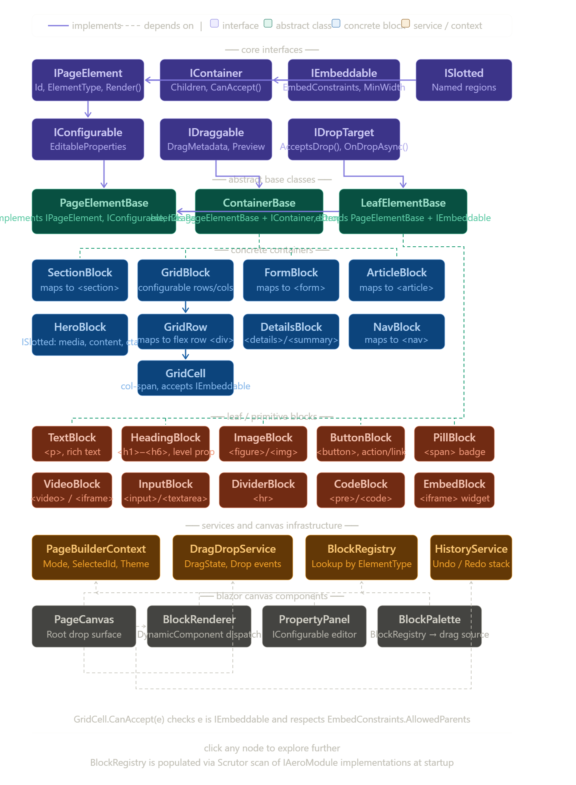

Here's how I'd architect this. Let me break it down into layers: interface taxonomy, HTML element mapping, and then the component dependency diagram.

> **AeroCMS decision note (2026-06-16):** This proposal is adopted as the
> target conceptual vocabulary for the WYSIWYG editor, but not as a literal
> implementation contract. The final AeroCMS model should stay close to
> semantic HTML, but persisted/domain nodes must not directly expose Blazor
> `RenderFragment Render(...)`, and persisted properties should not be an
> unconstrained `Dictionary<string, object>`. Use the existing DI-backed
> `IPageEditorDefinitionRegistry`, typed definition descriptors, typed or
> controlled JSON property values, separate renderer strategies/components, and
> source-generated/DI provider registration. Do not use Scrutor/reflection as
> the block-discovery boundary for third-party packages.



---

## Interface taxonomy

The core abstraction hierarchy centers on three concerns: **what can be rendered**, **what can contain children**, and **what can be dropped into a container**.

### Core interfaces

```csharp
// Anything renderable in the page builder
public interface IPageElement
{
    Guid Id { get; }
    string ElementType { get; }
    Dictionary<string, object> Properties { get; }
    RenderFragment Render(PageBuilderContext ctx);
}

// Can hold child IPageElement instances
public interface IContainer : IPageElement
{
    IReadOnlyList<IPageElement> Children { get; }
    ContainerConstraints Constraints { get; }   // MaxChildren, AllowedTypes, etc.
    Task AddChildAsync(IPageElement element, int index = -1);
    Task RemoveChildAsync(Guid elementId);
    Task MoveChildAsync(Guid elementId, int newIndex);
    bool CanAccept(IPageElement element);        // type-gate enforcement
}

// Can be dragged and dropped into an IContainer
public interface IEmbeddable : IPageElement
{
    EmbedConstraints EmbedConstraints { get; }  // which IContainer types accept this
    int MinWidth { get; }                        // grid column units
    int MaxWidth { get; }
}

// Can hold design-time configuration (property panel)
public interface IConfigurable : IPageElement
{
    IReadOnlyList<PropertyDescriptor> EditableProperties { get; }
    RenderFragment RenderPropertyPanel();
}

// Supports drag interaction in the builder canvas
public interface IDraggable
{
    DragMetadata GetDragMetadata();
    RenderFragment RenderDragPreview();
}

// Drop zone on the canvas
public interface IDropTarget
{
    bool AcceptsDrop(DragMetadata metadata);
    Task OnDropAsync(DragMetadata metadata, DropPosition position);
}
```

### Abstract base classes

```csharp
public abstract class PageElementBase : IPageElement, IConfigurable, IDraggable
{
    public Guid Id { get; } = Guid.NewGuid();
    public abstract string ElementType { get; }
    public Dictionary<string, object> Properties { get; } = new();
    public abstract RenderFragment Render(PageBuilderContext ctx);
    public abstract IReadOnlyList<PropertyDescriptor> EditableProperties { get; }
    public abstract RenderFragment RenderPropertyPanel();
    public virtual DragMetadata GetDragMetadata() => new(ElementType, Id);
    public virtual RenderFragment RenderDragPreview() => Render(PageBuilderContext.Preview);
}

public abstract class ContainerBase : PageElementBase, IContainer, IDropTarget
{
    protected List<IPageElement> _children = new();
    public IReadOnlyList<IPageElement> Children => _children.AsReadOnly();
    public abstract ContainerConstraints Constraints { get; }
    public abstract bool CanAccept(IPageElement element);
    public abstract bool AcceptsDrop(DragMetadata metadata);
    // ... AddChildAsync, RemoveChildAsync, MoveChildAsync default impl
}

public abstract class LeafElementBase : PageElementBase, IEmbeddable
{
    public abstract EmbedConstraints EmbedConstraints { get; }
    public virtual int MinWidth => 1;
    public virtual int MaxWidth => 12;
}
```

---

## HTML element → interface mapping

There are roughly **110+ HTML elements** in the living standard. For a page builder, ~40 are meaningful. Here's how they cluster:

| Category | Element | `IContainer` | `IEmbeddable` | Notes |
|---|---|:---:|:---:|---|
| **Structure** | `<section>` | ✅ | ✅ | Your `SectionBlock` |
| | `<article>` | ✅ | ✅ | Editorial container |
| | `<header>` | ✅ | ✅ | Top-of-section slot |
| | `<footer>` | ✅ | ✅ | Bottom-of-section slot |
| | `<aside>` | ✅ | ✅ | Sidebar container |
| | `<nav>` | ✅ | ✅ | Navigation region |
| | `<main>` | ✅ | ❌ | Root-only, not embeddable |
| | `<div>` | ✅ | ✅ | Generic `ColumnsBlock` row/cell |
| **Grid / Layout** | Grid row | ✅ | ✅ | Logical, maps to `<div>` flex row |
| | Grid cell | ✅ | ✅ | Maps to `<div>` with col-span |
| **Media** | `<figure>` | ✅ | ✅ | Contains `` + `<figcaption>` |
| | `<picture>` | ✅ | ✅ | Responsive image container |
| | `<video>` | ❌ | ✅ | Leaf — no accepted children |
| | `<audio>` | ❌ | ✅ | Leaf |
| | `` | ❌ | ✅ | Leaf |
| | `<iframe>` | ❌ | ✅ | Embed leaf |
| | `<canvas>` | ❌ | ✅ | Leaf |
| | `<svg>` | ❌ | ✅ | Leaf (inline SVG block) |
| **Forms** | `<form>` | ✅ | ✅ | Form container |
| | `<fieldset>` | ✅ | ✅ | Form group container |
| | `<input>` | ❌ | ✅ | Leaf |
| | `<textarea>` | ❌ | ✅ | Leaf |
| | `<select>` | ❌ | ✅ | Leaf (`<option>` managed internally) |
| | `<button>` | ❌ | ✅ | Leaf |
| | `<label>` | ❌ | ✅ | Leaf |
| **Typography** | `<p>` | ❌ | ✅ | Rich-text leaf |
| | `<h1>`–`<h6>` | ❌ | ✅ | Heading leaf (single block type `HeadingBlock` with level prop) |
| | `<blockquote>` | ✅ | ✅ | Contains inline elements |
| | `<pre>` / `<code>` | ❌ | ✅ | Code block leaf |
| | `<ul>` / `<ol>` | ✅ | ✅ | Manages `<li>` children |
| | `<li>` | ✅ | ❌ | Internal to list only |
| | `<dl>` | ✅ | ✅ | Definition list |
| | `<table>` | ✅ | ✅ | Table container |
| | `<tr>` / `<td>` / `<th>` | ✅ | ❌ | Managed by table internally |
| **Interactive** | `<details>` / `<summary>` | ✅ | ✅ | Accordion primitive |
| | `<dialog>` | ✅ | ✅ | Modal container |
| | `<a>` | ❌ | ✅ | Inline link leaf |
| | `<progress>` / `<meter>` | ❌ | ✅ | Data display leaf |
| | `<time>` | ❌ | ✅ | Semantic date leaf |
| | `<abbr>` / `<span>` | ❌ | ✅ | Inline annotation (managed by rich-text) |
| | `<hr>` | ❌ | ✅ | Divider leaf |
| | `<br>` | ❌ | ❌ | Internal to rich-text only |

---

## Architecture diagram---

## Key architectural decisions worth calling out

**`IContainer` vs `IEmbeddable` are not mutually exclusive.** Most structural blocks implement both — a `SectionBlock` can be dropped into a `GridCell` (it's `IEmbeddable`) and it can also hold children (it's `IContainer`). Purely semantic containers like `<main>` are `IContainer`-only since they sit at page root.

**`ISlotted` extends `IContainer`** with named regions. `HeroBlock` has slots named `"media"`, `"content"`, and `"cta"` — each slot is itself a mini-`IContainer` that only accepts specific types. This maps cleanly to Blazor's `RenderFragment` named child content pattern.

**`BlockRegistry` is your extension point.** It's populated by Scrutor at startup scanning all `IAeroModule` implementations. Third-party packages drop new blocks in by registering against the registry — fits perfectly with Aero CMS's existing modular pattern.

**`DragDropService` is a scoped Blazor service** holding reactive `DragState`. When a drag starts, it stores the `DragMetadata`. Every `IDropTarget` component subscribes to state changes and calls `CanAccept()` to show/hide drop indicators — no JS interop needed for the core logic, though you'll want JS for native HTML5 drag events wiring via `IJSRuntime`.

**`HistoryService` implements command pattern** — each mutation (`AddChild`, `RemoveChild`, `MoveChild`, property edit) is wrapped as a reversible `IPageCommand` pushed onto an undo stack. `Ctrl+Z` / `Ctrl+Y` just pop and replay.

**`GridBlock` owns the row/column model.** `GridBlock → GridRow → GridCell` is a 3-level containment hierarchy. `GridRow` exposes a `ColumnCount` and gap configuration. `GridCell` carries `ColSpan` (1–12) and is the actual `IDropTarget` that accepts leaf `IEmbeddable` blocks. This mirrors Wix's column structure exactly.


------- supplemental ---------------


## EmbedBlock

`EmbedBlock` is the escape hatch in the block taxonomy — it wraps an `<iframe>` and lets any third-party widget (YouTube, Google Maps, Typeform, Calendly, Loom, etc.) live inside the page builder as a first-class draggable primitive.

---

### Interface implementation

```csharp
public class EmbedBlock : LeafElementBase
{
    public override string ElementType => "embed";

    // --- IEmbeddable ---
    public override EmbedConstraints EmbedConstraints => new()
    {
        AllowedParents = [
            typeof(GridCell),
            typeof(SectionBlock),
            typeof(ArticleBlock)
        ],
        ForbiddenParents = [typeof(FormBlock)]  // iframes in forms are broken UX
    };

    public override int MinWidth => 3;   // too narrow to be useful at < 3 cols
    public override int MaxWidth => 12;

    // --- IConfigurable ---
    public override IReadOnlyList<PropertyDescriptor> EditableProperties =>
    [
        new("Url",         typeof(string),        category: "Source"),
        new("AspectRatio", typeof(AspectRatio),   category: "Layout"),
        new("Sandbox",     typeof(SandboxFlags),  category: "Security"),
        new("Loading",     typeof(LoadingMode),   category: "Performance"),
        new("Allow",       typeof(PermissionsPolicy), category: "Security"),
        new("Title",       typeof(string),        category: "Accessibility"),  // required for a11y
    ];
}
```

---

### The URL resolution pipeline

Raw user input can't go straight into `src`. You need a normalization + provider detection layer:

```csharp
public interface IEmbedUrlResolver
{
    bool CanResolve(Uri uri);
    EmbedResolvedUrl Resolve(Uri uri);
}

public record EmbedResolvedUrl(
    string EmbedSrc,           // final iframe src
    AspectRatio DefaultRatio,  // provider hint (16:9 for video, 4:3 for maps, etc.)
    SandboxFlags DefaultSandbox,
    PermissionsPolicy DefaultPolicy
);
```

Concrete resolvers registered via DI (open for extension, classic OCP):

```csharp
// Registered in IAeroModule for the Embeds feature
services.AddSingleton<IEmbedUrlResolver, YouTubeEmbedResolver>();
services.AddSingleton<IEmbedUrlResolver, VimeoEmbedResolver>();
services.AddSingleton<IEmbedUrlResolver, GoogleMapsEmbedResolver>();
services.AddSingleton<IEmbedUrlResolver, CalendlyEmbedResolver>();
services.AddSingleton<IEmbedUrlResolver, GenericIframeResolver>(); // fallback

// Composite resolver — tries each in order
services.AddSingleton<EmbedResolverPipeline>();
```

```csharp
public class YouTubeEmbedResolver : IEmbedUrlResolver
{
    // matches both watch?v= and youtu.be/ forms
    private static readonly Regex _pattern =
        new(@"(?:youtube\.com/watch\?v=|youtu\.be/)(?<id>[\w-]{11})", RegexOptions.Compiled);

    public bool CanResolve(Uri uri) =>
        uri.Host.Contains("youtube.com") || uri.Host.Contains("youtu.be");

    public EmbedResolvedUrl Resolve(Uri uri)
    {
        var id = _pattern.Match(uri.ToString()).Groups["id"].Value;
        return new(
            EmbedSrc:        $"https://www.youtube-nocookie.com/embed/{id}",
            DefaultRatio:    AspectRatio.Widescreen,   // 16:9
            DefaultSandbox:  SandboxFlags.AllowScripts | SandboxFlags.AllowSameOrigin,
            DefaultPolicy:   PermissionsPolicy.None
        );
    }
}
```

The `GenericIframeResolver` fallback accepts any HTTPS URL and applies maximally restrictive sandbox defaults — the user can loosen them explicitly in the property panel.

---

### Security model

This is the part most CMS implementations get wrong. Raw `<iframe>` without constraints is an XSS vector and a performance sink.

```csharp
[Flags]
public enum SandboxFlags
{
    None              = 0,
    AllowScripts      = 1 << 0,
    AllowSameOrigin   = 1 << 1,
    AllowForms        = 1 << 2,
    AllowPopups       = 1 << 3,
    AllowPresentation = 1 << 4,
    AllowModals       = 1 << 5,

    // Preset combos surfaced in the UI as named options
    Strict  = None,
    Video   = AllowScripts | AllowSameOrigin,
    Form    = AllowScripts | AllowSameOrigin | AllowForms,
    Full    = AllowScripts | AllowSameOrigin | AllowForms | AllowPopups
}
```

The property panel exposes these as a named radio group (Strict / Video / Form / Full) with a custom option that reveals the individual flag checkboxes. The `SandboxFlags` serialize to the correct `sandbox="allow-scripts allow-same-origin"` attribute string on render.

You also want a CSP-aware URL allow-list that operators configure at the site level:

```csharp
public class EmbedAllowList
{
    public IReadOnlySet<string> AllowedHosts { get; init; } = new HashSet<string>
    {
        "www.youtube-nocookie.com",
        "player.vimeo.com",
        "www.google.com",
        "calendly.com",
        "typeform.com"
    };

    public bool IsAllowed(Uri uri) =>
        AllowedHosts.Contains(uri.Host);
}
```

If the resolved URL isn't on the allow-list, the block renders a warning state in the editor rather than the iframe — surfacing the misconfiguration to the content author at edit time rather than silently failing at render time.

---

### Render output

```csharp
public override RenderFragment Render(PageBuilderContext ctx) => builder =>
{
    var ratio   = Properties.Get<AspectRatio>("AspectRatio");
    var sandbox = Properties.Get<SandboxFlags>("Sandbox");
    var src     = Properties.Get<string>("Url");
    var title   = Properties.Get<string>("Title");

    // Aspect-ratio wrapper — pure CSS, no JS
    builder.OpenElement(0, "div");
    builder.AddAttribute(1, "style",
        $"position:relative;padding-top:{ratio.ToCssPercent()};overflow:hidden;");

    builder.OpenElement(2, "iframe");
    builder.AddAttribute(3, "src",        src);
    builder.AddAttribute(4, "title",      title);
    builder.AddAttribute(5, "sandbox",    sandbox.ToCssString());
    builder.AddAttribute(6, "loading",    "lazy");
    builder.AddAttribute(7, "style",
        "position:absolute;inset:0;width:100%;height:100%;border:none;");
    builder.AddAttribute(8, "referrerpolicy", "no-referrer");
    builder.CloseElement(); // iframe

    builder.CloseElement(); // div
};
```

The aspect-ratio padding trick (`padding-top: 56.25%` for 16:9) keeps the embed proportional in the output-cached SSR render without any client-side JS, which matters for your static SSR + output cache architecture on Aero CMS public pages.

---

### Editor-mode overlay

In editor mode (`ctx.Mode == BuilderMode.Edit`), you don't actually render the live `<iframe>` — you render an inert placeholder instead. This prevents third-party scripts from executing inside the builder canvas, which causes all sorts of event interception chaos with your drag-drop surface:

```csharp
if (ctx.Mode == BuilderMode.Edit)
{
    // Render a placeholder card with provider logo + URL preview
    // Clicks select the block; double-click opens property panel
    RenderEditorPlaceholder(builder);
    return;
}
```

The placeholder shows the detected provider name, a thumbnail preview URL if available (YouTube has a predictable thumbnail CDN at `img.youtube.com/vi/{id}/mqdefault.jpg`), and the aspect ratio frame so the layout looks correct while editing.

---

### Where it sits in the hierarchy

```
IPageElement
  └── LeafElementBase (+ IEmbeddable)
        └── EmbedBlock
              │
              └── resolved by EmbedResolverPipeline
                    ├── YouTubeEmbedResolver
                    ├── VimeoEmbedResolver
                    ├── GoogleMapsEmbedResolver
                    ├── CalendlyEmbedResolver
                    └── GenericIframeResolver  ← fallback
```

It never implements `IContainer` — an embed is always terminal. If you ever need a YouTube video *inside* a hero with a text overlay, that's handled by dropping both an `EmbedBlock` and a `TextBlock` into the appropriate named slots of a `HeroBlock`, not by making `EmbedBlock` a container.
